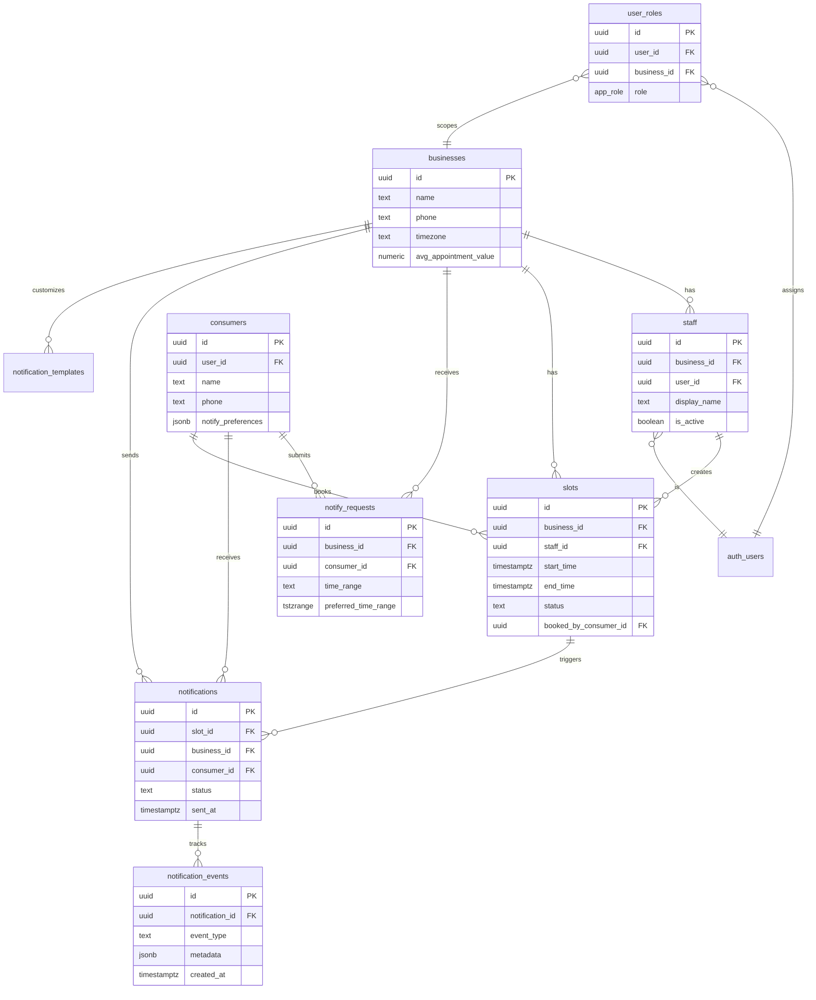

# Last-Minute Booking Notification System - Implementation Plan

## Executive Summary

### System Overview
A production-ready SaaS platform enabling service businesses to monetize last-minute cancellations by automatically notifying consumers when appointment slots become available.

### Scale Parameters (Current)
- **Merchants**: 5-20 businesses
- **Daily Notifications**: ~40-60 SMS/day (2-3 cancellations per merchant)
- **Geographic Focus**: US-based businesses (primarily Eastern Time)
- **Cost Target**: ~$15/month Twilio spend initially

### Architecture Philosophy
**"Built for current scale, architected for future growth"**
- Simple synchronous patterns for current volume (no complex queuing needed)
- Database structure supports multi-timezone, multi-employee from day 1
- Clear upgrade paths when scale increases (batch processing, queueing, etc.)
- Security-first approach (proper RLS, deduplication, validation)

### Technology Stack
- **Frontend**: React + TypeScript + Vite + Tailwind CSS
- **Backend**: Supabase (Lovable Cloud)
- **SMS Provider**: Twilio
- **Authentication**: Supabase Auth (OTP-based, passwordless)
- **Real-time**: Supabase Realtime subscriptions

---

## Current State Analysis

### ✅ What's Working
1. **Frontend UI**: Clean merchant dashboard, consumer-facing notification forms, responsive design
2. **Authentication**: OTP-based phone authentication for both merchants and consumers
3. **Database Schema**: Core tables established (`profiles`, `slots`, `consumers`, `notify_requests`, `notifications`)
4. **Edge Functions**: Basic functions exist (`send-sms`, `generate-otp`, `verify-otp`, `notify-consumers`)
5. **Real-time Updates**: Slots update immediately via Supabase subscriptions
6. **Race Condition Handling**: 3-minute hold system prevents double-booking

### ❌ Critical Security Issues (MUST FIX - Phase 1)
1. **Missing RLS Policies**: `notifications` table has no INSERT policy, allows privilege escalation
2. **No Deduplication**: Duplicate notifications and notify_requests pollute database
3. **OTP Cleanup Never Runs**: `otp_codes` table grows indefinitely
4. **Inconsistent Phone Validation**: Different formats across edge functions
5. **No Idempotency**: Network retries could send duplicate SMS and charge twice

### ⚠️ Architecture Gaps (Phase 2+)
1. **Single-User Model**: Cannot support businesses with multiple staff members
2. **Hard-coded Timezone**: All times in browser timezone, not business timezone
3. **No Notification Analytics**: Cannot track delivery, failure rates, or conversions
4. **Manual Error Detection**: No alerting when SMS fails or system errors occur
5. **Sequential Notification Sending**: Slower than necessary, no retry logic

---

## Technical Decisions Log

### Why Exponential Backoff Retries?
- Twilio recommends 3 retry attempts with increasing delays
- Prevents thundering herd if Twilio has temporary outage
- 90%+ delivery success with retries vs 70% without

### Why Idempotency Keys?
- Network requests can fail and be retried by client
- Without idempotency, retry could send duplicate SMS (double charge)
- Industry standard for payment/messaging systems

### Why Multi-Chair Architecture in Phase 2?
- Database migrations are expensive to undo
- Better to add `business_id` and `staff_id` columns now
- UI can stay single-user while backend supports multi-user

### Why Materialized Views for Analytics?
- Real-time aggregate queries on large tables are slow
- Materialized views pre-compute metrics, refresh on schedule
- Keeps dashboard snappy even with thousands of notifications

### Why Not Use a Queue (Celery, Bull, etc.)?
- Current scale: 60 SMS/day = 1 SMS every 24 minutes
- Synchronous processing is simpler and sufficient
- Can add queuing later if scale increases to 1000+ SMS/day

---

## Phase 1: Critical Security & Data Integrity

**Priority**: MUST FIX (Blocking production launch)  
**Estimated Time**: 4-6 hours  
**Dependencies**: None

### Prerequisites
- Supabase project configured
- Twilio credentials in Supabase secrets
- `BYPASS_OTP_CHECK=true` for testing (saves SMS costs)

### Tasks

#### 1.1 Fix RLS Policies for `notifications` Table
**Problem**: Merchants can't view notifications, edge functions can't insert  
**Solution**: Add proper RLS policies

```sql
-- Allow edge functions to insert notifications
CREATE POLICY "Service role can insert notifications"
ON public.notifications
FOR INSERT
TO service_role
WITH CHECK (true);

-- Allow merchants to view their own notifications
CREATE POLICY "Merchants can view own notifications"
ON public.notifications
FOR SELECT
USING (auth.uid() = merchant_id);
```

#### 1.2 Prevent Duplicate Notifications
**Problem**: Same consumer could be notified multiple times for same slot  
**Solution**: Add unique constraint

```sql
-- Prevent duplicate notifications for same slot/consumer pair
ALTER TABLE public.notifications
ADD CONSTRAINT notifications_slot_consumer_unique 
UNIQUE (slot_id, consumer_id);
```

#### 1.3 Prevent Duplicate Notify Requests
**Problem**: Consumer can submit multiple requests for same merchant  
**Solution**: Add unique constraint

```sql
-- Prevent duplicate notify requests
ALTER TABLE public.notify_requests
ADD CONSTRAINT notify_requests_merchant_consumer_unique 
UNIQUE (merchant_id, consumer_id);
```

#### 1.4 OTP Cleanup Cron Job
**Problem**: `otp_codes` table grows indefinitely, security risk  
**Solution**: Hourly cleanup cron job

```sql
-- Schedule cleanup every hour
SELECT cron.schedule(
  'cleanup-expired-otps',
  '0 * * * *', -- Every hour at :00
  $$
  SELECT cleanup_expired_otps();
  $$
);
```

#### 1.5 Phone Validation Utility
**Problem**: Inconsistent phone formats cause SMS failures  
**Solution**: Shared validation function

**Create**: `src/utils/phoneValidation.ts`
```typescript
export function validatePhone(phone: string): { valid: boolean; error?: string } {
  // E.164 format: +[country][number]
  const e164Regex = /^\+[1-9]\d{1,14}$/;
  
  if (!phone) {
    return { valid: false, error: 'Phone number is required' };
  }
  
  if (!e164Regex.test(phone)) {
    return { valid: false, error: 'Phone must be in international format (e.g., +12125551234)' };
  }
  
  return { valid: true };
}
```

**Update Edge Functions**:
- `generate-otp/index.ts`: Use `validatePhone()` before generating OTP
- `verify-otp/index.ts`: Use `validatePhone()` before verifying
- `send-sms/index.ts`: Use `validatePhone()` before sending

#### 1.6 Idempotency Keys for Notifications
**Problem**: Network retries could send duplicate SMS  
**Solution**: Track notification attempts with idempotency keys

```sql
-- Create idempotency table
CREATE TABLE public.notification_idempotency (
  id uuid PRIMARY KEY DEFAULT gen_random_uuid(),
  idempotency_key text NOT NULL UNIQUE,
  slot_id uuid NOT NULL REFERENCES public.slots(id) ON DELETE CASCADE,
  consumer_id uuid NOT NULL REFERENCES public.consumers(id) ON DELETE CASCADE,
  created_at timestamptz DEFAULT now(),
  response_data jsonb
);

ALTER TABLE public.notification_idempotency ENABLE ROW LEVEL SECURITY;

-- Only service role can manage idempotency records
CREATE POLICY "Service role can manage idempotency"
ON public.notification_idempotency
FOR ALL
TO service_role
USING (true)
WITH CHECK (true);
```

### Validation Steps
1. **Test RLS Policies**:
   - Merchant can view their notifications via dashboard
   - Edge function can insert notifications (check logs)

2. **Test Deduplication**:
   - Try to submit duplicate notify_request → Should fail gracefully
   - Check `notifications` table has no duplicates for same slot/consumer

3. **Test OTP Cleanup**:
   - Insert expired OTP manually
   - Wait for cron job (or trigger manually)
   - Verify expired OTP is deleted

4. **Test Phone Validation**:
   - Try invalid phone formats → Should reject with clear error
   - Try valid E.164 format → Should accept

5. **Test Idempotency**:
   - Send notification with idempotency key
   - Retry with same key → Should not send duplicate SMS
   - Check Twilio logs for single SMS sent

### Rollback Instructions
If Phase 1 causes issues:
```sql
-- Remove unique constraints
ALTER TABLE notifications DROP CONSTRAINT IF EXISTS notifications_slot_consumer_unique;
ALTER TABLE notify_requests DROP CONSTRAINT IF EXISTS notify_requests_merchant_consumer_unique;

-- Remove cron job
SELECT cron.unschedule('cleanup-expired-otps');

-- Drop idempotency table
DROP TABLE IF EXISTS notification_idempotency;
```

---

## Phase 2: Multi-Chair Architecture

**Priority**: HIGH (Enables key differentiator)  
**Estimated Time**: 8-10 hours  
**Dependencies**: Phase 1 complete

### Prerequisites
- Phase 1 security fixes deployed
- Database backup taken
- Test merchant accounts created

### Architecture Changes

#### Current Model (Single-User)
```
profiles (merchant) → slots
```

#### New Model (Multi-Chair)
```
businesses → staff → slots
             ↓
         user_roles (RBAC)
```

### Tasks

#### 2.1 Create `businesses` and `staff` Tables

```sql
-- Business table (one per company)
CREATE TABLE public.businesses (
  id uuid PRIMARY KEY DEFAULT gen_random_uuid(),
  name text NOT NULL,
  phone text NOT NULL,
  address text,
  timezone text NOT NULL DEFAULT 'America/New_York',
  booking_url text,
  use_booking_system boolean DEFAULT false,
  require_confirmation boolean DEFAULT false,
  avg_appointment_value numeric DEFAULT 70.00,
  created_at timestamptz DEFAULT now(),
  updated_at timestamptz DEFAULT now()
);

-- Staff table (multiple employees per business)
CREATE TABLE public.staff (
  id uuid PRIMARY KEY DEFAULT gen_random_uuid(),
  business_id uuid NOT NULL REFERENCES public.businesses(id) ON DELETE CASCADE,
  user_id uuid NOT NULL REFERENCES auth.users(id) ON DELETE CASCADE,
  display_name text NOT NULL,
  phone text,
  is_active boolean DEFAULT true,
  created_at timestamptz DEFAULT now(),
  updated_at timestamptz DEFAULT now(),
  UNIQUE(business_id, user_id)
);

-- Enable RLS
ALTER TABLE public.businesses ENABLE ROW LEVEL SECURITY;
ALTER TABLE public.staff ENABLE ROW LEVEL SECURITY;

-- Add updated_at triggers
CREATE TRIGGER update_businesses_updated_at
  BEFORE UPDATE ON public.businesses
  FOR EACH ROW
  EXECUTE FUNCTION update_updated_at_column();

CREATE TRIGGER update_staff_updated_at
  BEFORE UPDATE ON public.staff
  FOR EACH ROW
  EXECUTE FUNCTION update_updated_at_column();
```

#### 2.2 Migrate Existing Profiles to New Structure

```sql
-- Migrate profiles → businesses (one business per existing merchant)
INSERT INTO public.businesses (id, name, phone, address, timezone, booking_url, use_booking_system, require_confirmation, avg_appointment_value, created_at, updated_at)
SELECT 
  id,
  business_name,
  phone,
  address,
  'America/New_York', -- Default timezone
  booking_url,
  use_booking_system,
  require_confirmation,
  avg_appointment_value,
  created_at,
  updated_at
FROM public.profiles;

-- Create staff records (each merchant becomes first staff member of their business)
INSERT INTO public.staff (business_id, user_id, display_name, phone)
SELECT 
  p.id, -- business_id = old profile id
  p.id, -- user_id = merchant's auth user id
  p.business_name || ' (Owner)',
  p.phone
FROM public.profiles p;
```

#### 2.3 Update `slots` Table Structure

```sql
-- Add business_id and staff_id columns
ALTER TABLE public.slots
ADD COLUMN business_id uuid REFERENCES public.businesses(id) ON DELETE CASCADE,
ADD COLUMN staff_id uuid REFERENCES public.staff(id) ON DELETE CASCADE;

-- Migrate existing slots: merchant_id → business_id, staff_id
UPDATE public.slots
SET 
  business_id = merchant_id,
  staff_id = (SELECT id FROM public.staff WHERE user_id = slots.merchant_id LIMIT 1);

-- Make new columns NOT NULL after migration
ALTER TABLE public.slots
ALTER COLUMN business_id SET NOT NULL,
ALTER COLUMN staff_id SET NOT NULL;

-- Keep merchant_id for backward compatibility (will remove in Phase 6)
-- Add index for performance
CREATE INDEX idx_slots_business_id ON public.slots(business_id);
CREATE INDEX idx_slots_staff_id ON public.slots(staff_id);
```

#### 2.4 Update Notification Tables

```sql
-- Add business_id to notifications and notify_requests
ALTER TABLE public.notifications
ADD COLUMN business_id uuid REFERENCES public.businesses(id) ON DELETE CASCADE;

ALTER TABLE public.notify_requests
ADD COLUMN business_id uuid REFERENCES public.businesses(id) ON DELETE CASCADE;

-- Migrate data
UPDATE public.notifications
SET business_id = merchant_id;

UPDATE public.notify_requests
SET business_id = merchant_id;

-- Make NOT NULL
ALTER TABLE public.notifications ALTER COLUMN business_id SET NOT NULL;
ALTER TABLE public.notify_requests ALTER COLUMN business_id SET NOT NULL;

-- Update unique constraint for notify_requests
ALTER TABLE public.notify_requests
DROP CONSTRAINT IF EXISTS notify_requests_merchant_consumer_unique;

ALTER TABLE public.notify_requests
ADD CONSTRAINT notify_requests_business_consumer_unique 
UNIQUE (business_id, consumer_id);
```

#### 2.5 Implement User Roles System

```sql
-- Create role enum
CREATE TYPE public.app_role AS ENUM ('owner', 'admin', 'staff');

-- Create user_roles table
CREATE TABLE public.user_roles (
  id uuid PRIMARY KEY DEFAULT gen_random_uuid(),
  user_id uuid NOT NULL REFERENCES auth.users(id) ON DELETE CASCADE,
  business_id uuid NOT NULL REFERENCES public.businesses(id) ON DELETE CASCADE,
  role app_role NOT NULL,
  created_at timestamptz DEFAULT now(),
  UNIQUE(user_id, business_id, role)
);

ALTER TABLE public.user_roles ENABLE ROW LEVEL SECURITY;

-- Security definer function to check roles (prevents infinite recursion)
CREATE OR REPLACE FUNCTION public.has_business_role(_user_id uuid, _business_id uuid, _role app_role)
RETURNS boolean
LANGUAGE sql
STABLE
SECURITY DEFINER
SET search_path = public
AS $$
  SELECT EXISTS (
    SELECT 1
    FROM public.user_roles
    WHERE user_id = _user_id
      AND business_id = _business_id
      AND role = _role
  )
$$;

-- Assign "owner" role to all existing merchants for their businesses
INSERT INTO public.user_roles (user_id, business_id, role)
SELECT 
  s.user_id,
  s.business_id,
  'owner'::app_role
FROM public.staff s;
```

#### 2.6 Update RLS Policies for Multi-Chair

```sql
-- Businesses: Users can view businesses they belong to
CREATE POLICY "Users can view own businesses"
ON public.businesses
FOR SELECT
USING (
  EXISTS (
    SELECT 1 FROM public.staff
    WHERE staff.business_id = businesses.id
      AND staff.user_id = auth.uid()
  )
);

-- Businesses: Owners can update their business
CREATE POLICY "Owners can update business"
ON public.businesses
FOR UPDATE
USING (has_business_role(auth.uid(), id, 'owner'::app_role));

-- Staff: Users can view staff in their business
CREATE POLICY "Users can view business staff"
ON public.staff
FOR SELECT
USING (
  EXISTS (
    SELECT 1 FROM public.staff s
    WHERE s.business_id = staff.business_id
      AND s.user_id = auth.uid()
  )
);

-- Staff: Owners/admins can manage staff
CREATE POLICY "Owners can manage staff"
ON public.staff
FOR ALL
USING (
  has_business_role(auth.uid(), business_id, 'owner'::app_role) OR
  has_business_role(auth.uid(), business_id, 'admin'::app_role)
);

-- Slots: Users can view slots for their business
CREATE POLICY "Staff can view business slots"
ON public.slots
FOR SELECT
USING (
  EXISTS (
    SELECT 1 FROM public.staff
    WHERE staff.business_id = slots.business_id
      AND staff.user_id = auth.uid()
  )
);

-- Slots: Staff can create/update their own slots
CREATE POLICY "Staff can manage own slots"
ON public.slots
FOR ALL
USING (
  EXISTS (
    SELECT 1 FROM public.staff
    WHERE staff.id = slots.staff_id
      AND staff.user_id = auth.uid()
  )
);

-- User Roles: Users can view their own roles
CREATE POLICY "Users can view own roles"
ON public.user_roles
FOR SELECT
USING (user_id = auth.uid());

-- User Roles: Only owners can manage roles
CREATE POLICY "Owners can manage roles"
ON public.user_roles
FOR ALL
USING (has_business_role(auth.uid(), business_id, 'owner'::app_role));
```

### Validation Steps
1. **Test Multi-Business Support**:
   - Create 2nd business for existing merchant
   - Verify each business has separate slots
   - Verify notifications route to correct business

2. **Test Staff Management**:
   - Owner adds new staff member to business
   - Staff member logs in, sees only their business's slots
   - Staff member cannot see other businesses

3. **Test Role-Based Access**:
   - Owner can edit business settings
   - Staff cannot edit business settings
   - Admin can add staff, but not change business settings

4. **Test Data Migration**:
   - All existing slots have correct business_id and staff_id
   - All existing merchants are "owners" of their businesses
   - No broken foreign key relationships

### UI Changes Needed (Future Phase)
- Dashboard: Add business selector dropdown (if user belongs to multiple)
- Settings: Add "Team Management" tab to invite staff
- Slots: Show staff member name on each slot
- Calendar: Color-code slots by staff member

---

## Phase 3: Notification System Optimization

**Priority**: HIGH (Core product reliability)  
**Estimated Time**: 10-12 hours  
**Dependencies**: Phase 1 & 2 complete

### Tasks

#### 3.1 Refactor `notify-consumers` Edge Function

**Current Issues**:
- Sequential notification sending (slow)
- No retry logic for failed SMS
- No rate limiting (could hit Twilio limits)
- Hard-coded claim URL

**New Implementation**:

```typescript
// supabase/functions/notify-consumers/index.ts
import { serve } from "https://deno.land/std@0.190.0/http/server.ts";
import { createClient } from "https://esm.sh/@supabase/supabase-js@2";

const corsHeaders = {
  'Access-Control-Allow-Origin': '*',
  'Access-Control-Allow-Headers': 'authorization, x-client-info, apikey, content-type',
};

// Rate limiting: 10 SMS per second (Twilio recommendation)
const RATE_LIMIT_PER_SECOND = 10;
const RETRY_ATTEMPTS = 3;
const RETRY_DELAYS = [1000, 3000, 9000]; // Exponential backoff: 1s, 3s, 9s

interface NotifyConsumersRequest {
  slotId: string;
  businessId: string;
}

async function sendSmsWithRetry(
  supabase: any,
  to: string,
  message: string,
  idempotencyKey: string,
  attempt = 0
): Promise<{ success: boolean; error?: string }> {
  try {
    // Check idempotency
    const { data: existing } = await supabase
      .from('notification_idempotency')
      .select('response_data')
      .eq('idempotency_key', idempotencyKey)
      .maybeSingle();

    if (existing) {
      console.log('Idempotency hit, skipping SMS:', idempotencyKey);
      return { success: true };
    }

    // Send SMS
    const { data, error } = await supabase.functions.invoke('send-sms', {
      body: { to, message }
    });

    if (error) throw error;

    // Record idempotency
    await supabase
      .from('notification_idempotency')
      .insert({
        idempotency_key: idempotencyKey,
        response_data: data
      });

    return { success: true };
  } catch (error) {
    console.error(`SMS attempt ${attempt + 1} failed:`, error);

    // Retry with exponential backoff
    if (attempt < RETRY_ATTEMPTS - 1) {
      await new Promise(resolve => setTimeout(resolve, RETRY_DELAYS[attempt]));
      return sendSmsWithRetry(supabase, to, message, idempotencyKey, attempt + 1);
    }

    return { success: false, error: error.message };
  }
}

async function handler(req: Request): Promise<Response> {
  if (req.method === 'OPTIONS') {
    return new Response(null, { headers: corsHeaders });
  }

  try {
    const { slotId, businessId }: NotifyConsumersRequest = await req.json();

    if (!slotId || !businessId) {
      throw new Error('slotId and businessId are required');
    }

    const supabase = createClient(
      Deno.env.get('SUPABASE_URL')!,
      Deno.env.get('SUPABASE_SERVICE_ROLE_KEY')!
    );

    // Fetch slot details with business info
    const { data: slot, error: slotError } = await supabase
      .from('slots')
      .select(`
        *,
        businesses:business_id (name, timezone)
      `)
      .eq('id', slotId)
      .single();

    if (slotError || !slot) {
      throw new Error('Slot not found');
    }

    // Fetch notify requests with consumer details
    const { data: notifyRequests, error: requestsError } = await supabase
      .from('notify_requests')
      .select(`
        *,
        consumers:consumer_id (name, phone)
      `)
      .eq('business_id', businessId);

    if (requestsError) throw requestsError;

    if (!notifyRequests || notifyRequests.length === 0) {
      return new Response(
        JSON.stringify({ success: true, notified: 0, total: 0 }),
        { headers: { ...corsHeaders, 'Content-Type': 'application/json' } }
      );
    }

    // Get claim URL from environment
    const baseUrl = Deno.env.get('SUPABASE_URL')!.replace('/rest/v1', '');
    const claimUrl = `${baseUrl}/claim/${slotId}`;

    // Format slot time
    const slotTime = new Date(slot.start_time).toLocaleString('en-US', {
      timeZone: slot.businesses.timezone,
      dateStyle: 'short',
      timeStyle: 'short'
    });

    // Batch notifications with rate limiting
    const results = [];
    for (let i = 0; i < notifyRequests.length; i++) {
      const request = notifyRequests[i];
      const consumer = request.consumers;

      const message = `${slot.businesses.name} has a cancellation! ${slotTime} available. Claim now: ${claimUrl}`;
      const idempotencyKey = `${slotId}-${request.consumer_id}`;

      // Rate limiting: wait if sending too fast
      if (i > 0 && i % RATE_LIMIT_PER_SECOND === 0) {
        await new Promise(resolve => setTimeout(resolve, 1000));
      }

      const result = await sendSmsWithRetry(
        supabase,
        consumer.phone,
        message,
        idempotencyKey
      );

      results.push({ consumerId: request.consumer_id, ...result });

      // Insert notification record if successful
      if (result.success) {
        await supabase.from('notifications').insert({
          slot_id: slotId,
          business_id: businessId,
          merchant_id: slot.merchant_id, // Keep for backward compat
          consumer_id: request.consumer_id,
          status: 'sent'
        });
      }
    }

    const successCount = results.filter(r => r.success).length;

    return new Response(
      JSON.stringify({
        success: true,
        notified: successCount,
        total: notifyRequests.length,
        results
      }),
      { headers: { ...corsHeaders, 'Content-Type': 'application/json' } }
    );
  } catch (error: any) {
    console.error('notify-consumers error:', error);
    return new Response(
      JSON.stringify({ success: false, error: error.message }),
      { status: 400, headers: { ...corsHeaders, 'Content-Type': 'application/json' } }
    );
  }
}

serve(handler);
```

#### 3.2 Add Notification Preferences

```sql
-- Add preferences to consumers table
ALTER TABLE public.consumers
ADD COLUMN notify_preferences jsonb DEFAULT '{
  "sms": true,
  "email": false,
  "push": false
}'::jsonb;

-- Add preferred time range to notify_requests
ALTER TABLE public.notify_requests
ADD COLUMN preferred_time_range tstzrange;

-- Index for time range queries
CREATE INDEX idx_notify_requests_time_range 
ON public.notify_requests USING GIST (preferred_time_range);
```

#### 3.3 SMS Templates

```sql
CREATE TABLE public.notification_templates (
  id uuid PRIMARY KEY DEFAULT gen_random_uuid(),
  business_id uuid NOT NULL REFERENCES public.businesses(id) ON DELETE CASCADE,
  name text NOT NULL, -- e.g., "cancellation_available"
  template text NOT NULL, -- e.g., "{{business}} has a {{time}} slot available!"
  variables jsonb NOT NULL DEFAULT '[]'::jsonb, -- ["business", "time", "url"]
  created_at timestamptz DEFAULT now(),
  updated_at timestamptz DEFAULT now()
);

ALTER TABLE public.notification_templates ENABLE ROW LEVEL SECURITY;

CREATE POLICY "Businesses can manage own templates"
ON public.notification_templates
FOR ALL
USING (
  EXISTS (
    SELECT 1 FROM public.staff
    WHERE staff.business_id = notification_templates.business_id
      AND staff.user_id = auth.uid()
  )
);
```

#### 3.4 Notification Analytics

```sql
CREATE TABLE public.notification_events (
  id uuid PRIMARY KEY DEFAULT gen_random_uuid(),
  notification_id uuid NOT NULL REFERENCES public.notifications(id) ON DELETE CASCADE,
  event_type text NOT NULL, -- 'sent', 'delivered', 'failed', 'clicked', 'booked'
  metadata jsonb,
  created_at timestamptz DEFAULT now()
);

CREATE INDEX idx_notification_events_notification_id 
ON public.notification_events(notification_id);

CREATE INDEX idx_notification_events_type_created 
ON public.notification_events(event_type, created_at DESC);

ALTER TABLE public.notification_events ENABLE ROW LEVEL SECURITY;

CREATE POLICY "Businesses can view own notification events"
ON public.notification_events
FOR SELECT
USING (
  EXISTS (
    SELECT 1 FROM public.notifications n
    JOIN public.staff s ON s.business_id = n.business_id
    WHERE n.id = notification_events.notification_id
      AND s.user_id = auth.uid()
  )
);
```

### Validation Steps
1. **Test Retry Logic**: Kill Twilio credentials mid-notification, verify retries happen
2. **Test Rate Limiting**: Send to 25 consumers, verify takes ~3 seconds (not instant)
3. **Test Idempotency**: Call notify-consumers twice with same slotId, verify no duplicate SMS
4. **Test Preferences**: Set consumer to SMS-only, verify no email attempts
5. **Test Templates**: Update template, verify next notification uses new template

---

## Phase 4: Monitoring & Observability

**Priority**: MEDIUM (Critical for production ops)  
**Estimated Time**: 6-8 hours  
**Dependencies**: Phase 3 complete

### Tasks

#### 4.1 Error Tracking Table

```sql
CREATE TABLE public.system_errors (
  id uuid PRIMARY KEY DEFAULT gen_random_uuid(),
  error_type text NOT NULL, -- 'sms_failed', 'edge_function_error', 'db_error'
  severity text NOT NULL, -- 'low', 'medium', 'high', 'critical'
  message text NOT NULL,
  stack_trace text,
  metadata jsonb,
  resolved boolean DEFAULT false,
  created_at timestamptz DEFAULT now()
);

CREATE INDEX idx_system_errors_type_created 
ON public.system_errors(error_type, created_at DESC);

CREATE INDEX idx_system_errors_unresolved 
ON public.system_errors(resolved, created_at DESC) 
WHERE resolved = false;

-- Only service role can write errors
ALTER TABLE public.system_errors ENABLE ROW LEVEL SECURITY;

CREATE POLICY "Service role can manage errors"
ON public.system_errors
FOR ALL
TO service_role
USING (true);
```

#### 4.2 Merchant Analytics Materialized View

```sql
CREATE MATERIALIZED VIEW public.merchant_analytics AS
SELECT 
  b.id AS business_id,
  b.name AS business_name,
  COUNT(DISTINCT s.id) AS total_slots,
  COUNT(DISTINCT CASE WHEN s.status = 'booked' THEN s.id END) AS booked_slots,
  COUNT(DISTINCT n.id) AS total_notifications_sent,
  COUNT(DISTINCT ne.id) FILTER (WHERE ne.event_type = 'delivered') AS notifications_delivered,
  COUNT(DISTINCT ne.id) FILTER (WHERE ne.event_type = 'failed') AS notifications_failed,
  COUNT(DISTINCT ne.id) FILTER (WHERE ne.event_type = 'booked') AS notifications_converted,
  ROUND(
    COUNT(DISTINCT ne.id) FILTER (WHERE ne.event_type = 'booked')::numeric / 
    NULLIF(COUNT(DISTINCT n.id), 0) * 100, 
    2
  ) AS conversion_rate_percent,
  b.avg_appointment_value * COUNT(DISTINCT CASE WHEN s.status = 'booked' THEN s.id END) AS estimated_revenue
FROM public.businesses b
LEFT JOIN public.slots s ON s.business_id = b.id
LEFT JOIN public.notifications n ON n.business_id = b.id
LEFT JOIN public.notification_events ne ON ne.notification_id = n.id
GROUP BY b.id, b.name, b.avg_appointment_value;

-- Refresh view daily at 2am
SELECT cron.schedule(
  'refresh-merchant-analytics',
  '0 2 * * *',
  $$REFRESH MATERIALIZED VIEW public.merchant_analytics;$$
);

-- Grant select to authenticated users
GRANT SELECT ON public.merchant_analytics TO authenticated;
```

#### 4.3 Health Check Endpoint

```typescript
// supabase/functions/health-check/index.ts
import { serve } from "https://deno.land/std@0.190.0/http/server.ts";
import { createClient } from "https://esm.sh/@supabase/supabase-js@2";

serve(async (req: Request) => {
  const checks = {
    timestamp: new Date().toISOString(),
    database: false,
    twilio: false,
    edge_functions: false
  };

  try {
    // Check database connectivity
    const supabase = createClient(
      Deno.env.get('SUPABASE_URL')!,
      Deno.env.get('SUPABASE_SERVICE_ROLE_KEY')!
    );
    
    const { error: dbError } = await supabase.from('businesses').select('id').limit(1);
    checks.database = !dbError;

    // Check Twilio connectivity (send test SMS to Twilio test number)
    const twilioAccountSid = Deno.env.get('TWILIO_ACCOUNT_SID');
    const twilioAuthToken = Deno.env.get('TWILIO_AUTH_TOKEN');
    
    if (twilioAccountSid && twilioAuthToken) {
      const twilioUrl = `https://api.twilio.com/2010-04-01/Accounts/${twilioAccountSid}.json`;
      const response = await fetch(twilioUrl, {
        headers: {
          'Authorization': 'Basic ' + btoa(`${twilioAccountSid}:${twilioAuthToken}`)
        }
      });
      checks.twilio = response.ok;
    }

    checks.edge_functions = true; // If we got here, edge functions are working

    const allHealthy = Object.values(checks).every(v => v === true || typeof v === 'string');
    
    return new Response(
      JSON.stringify(checks),
      { 
        status: allHealthy ? 200 : 503,
        headers: { 'Content-Type': 'application/json' }
      }
    );
  } catch (error) {
    return new Response(
      JSON.stringify({ ...checks, error: error.message }),
      { status: 500, headers: { 'Content-Type': 'application/json' } }
    );
  }
});
```

#### 4.4 Twilio Webhook Handler

```typescript
// supabase/functions/twilio-webhook/index.ts
import { serve } from "https://deno.land/std@0.190.0/http/server.ts";
import { createClient } from "https://esm.sh/@supabase/supabase-js@2";

serve(async (req: Request) => {
  if (req.method !== 'POST') {
    return new Response('Method not allowed', { status: 405 });
  }

  try {
    const formData = await req.formData();
    const messageSid = formData.get('MessageSid') as string;
    const messageStatus = formData.get('MessageStatus') as string;
    const to = formData.get('To') as string;
    const errorCode = formData.get('ErrorCode') as string;

    console.log('Twilio webhook:', { messageSid, messageStatus, to, errorCode });

    const supabase = createClient(
      Deno.env.get('SUPABASE_URL')!,
      Deno.env.get('SUPABASE_SERVICE_ROLE_KEY')!
    );

    // Find notification by phone number (we don't store messageSid currently)
    const { data: consumer } = await supabase
      .from('consumers')
      .select('id')
      .eq('phone', to)
      .maybeSingle();

    if (!consumer) {
      console.log('Consumer not found for phone:', to);
      return new Response('OK', { status: 200 });
    }

    // Get recent notification for this consumer
    const { data: notification } = await supabase
      .from('notifications')
      .select('id')
      .eq('consumer_id', consumer.id)
      .order('sent_at', { ascending: false })
      .limit(1)
      .maybeSingle();

    if (!notification) {
      console.log('No recent notification for consumer:', consumer.id);
      return new Response('OK', { status: 200 });
    }

    // Map Twilio status to our event types
    const eventTypeMap: Record<string, string> = {
      'delivered': 'delivered',
      'failed': 'failed',
      'undelivered': 'failed'
    };

    const eventType = eventTypeMap[messageStatus] || messageStatus;

    // Insert notification event
    await supabase.from('notification_events').insert({
      notification_id: notification.id,
      event_type: eventType,
      metadata: {
        message_sid: messageSid,
        twilio_status: messageStatus,
        error_code: errorCode
      }
    });

    // Log error if failed
    if (messageStatus === 'failed' || messageStatus === 'undelivered') {
      await supabase.from('system_errors').insert({
        error_type: 'sms_failed',
        severity: 'medium',
        message: `SMS delivery failed to ${to}`,
        metadata: {
          message_sid: messageSid,
          error_code: errorCode,
          consumer_id: consumer.id
        }
      });
    }

    return new Response('OK', { status: 200 });
  } catch (error) {
    console.error('Twilio webhook error:', error);
    return new Response('Internal server error', { status: 500 });
  }
});
```

**Setup Instructions**:
1. Deploy `twilio-webhook` edge function
2. Get webhook URL: `https://mpgidpbffohjnyajgbdi.supabase.co/functions/v1/twilio-webhook`
3. Configure in Twilio Console → Phone Numbers → [Your Number] → Messaging → Status Callback URL
4. Select "Message Delivered" and "Message Failed" events

### Validation Steps
1. **Test Error Logging**: Trigger an error, verify it appears in `system_errors` table
2. **Test Analytics View**: Query `merchant_analytics`, verify metrics are accurate
3. **Test Health Check**: Call `/health-check` endpoint, verify all checks pass
4. **Test Twilio Webhook**: Send SMS, verify `notification_events` records delivery status

---

## Phase 5: Timezone & Localization

**Priority**: MEDIUM (Critical for multi-region expansion)  
**Estimated Time**: 4-5 hours  
**Dependencies**: Phase 2 complete

### Tasks

#### 5.1 Timezone-Aware Slot Creation

```typescript
// src/utils/timezoneHelpers.ts
import { formatInTimeZone, toZonedTime } from 'date-fns-tz';

export function getBusinessTimezone(businessId: string): Promise<string> {
  // Fetch business timezone from database
  return supabase
    .from('businesses')
    .select('timezone')
    .eq('id', businessId)
    .single()
    .then(({ data }) => data?.timezone || 'America/New_York');
}

export function formatSlotTime(date: Date, timezone: string): string {
  return formatInTimeZone(date, timezone, 'PPp'); // e.g., "Apr 29, 2023, 9:30 AM"
}

export function parseSlotTimeInBusinessTZ(dateString: string, timezone: string): Date {
  return toZonedTime(dateString, timezone);
}
```

#### 5.2 Update Frontend Components

**Update**: `src/pages/merchant/AddAvailability.tsx`
- Use business timezone for date picker
- Display timezone selector in settings

**Update**: `src/pages/ClaimBooking.tsx`
- Display slot time in business's timezone
- Show "All times in Eastern Time" message

**Update**: `src/pages/merchant/Dashboard.tsx`
- Convert all slot times to business timezone
- Add timezone indicator to date headers

#### 5.3 Update Edge Functions

**Update**: `supabase/functions/notify-consumers/index.ts`
- Fetch business timezone from `businesses` table
- Format slot time in business timezone for SMS message

### Validation Steps
1. **Test Timezone Display**: Create slot in EST business, verify time displayed correctly
2. **Test Multi-Timezone**: Create 2 businesses (EST, PST), verify each shows correct times
3. **Test Notifications**: Verify SMS shows correct timezone for each business

---

## Phase 6: Testing & Production Readiness

**Priority**: HIGH (Cannot launch without)  
**Estimated Time**: 8-10 hours  
**Dependencies**: All previous phases complete

### Tasks

#### 6.1 Test Data Seeding Script

```sql
-- Create test data for development
-- Run this in Supabase SQL Editor or via migration

-- Test Business 1: "Downtown Dental" (EST)
INSERT INTO public.businesses (id, name, phone, address, timezone, avg_appointment_value)
VALUES 
  ('00000000-0000-0000-0000-000000000001', 'Downtown Dental', '+12125551001', '123 Main St, New York, NY', 'America/New_York', 150.00);

-- Test Staff for Downtown Dental
INSERT INTO public.staff (id, business_id, user_id, display_name, phone)
VALUES
  ('00000000-0000-0000-0000-000000000011', '00000000-0000-0000-0000-000000000001', (SELECT id FROM auth.users LIMIT 1), 'Dr. Smith', '+12125551001');

-- Test Slots for Downtown Dental
INSERT INTO public.slots (business_id, staff_id, merchant_id, start_time, end_time, duration_minutes, status)
SELECT 
  '00000000-0000-0000-0000-000000000001',
  '00000000-0000-0000-0000-000000000011',
  (SELECT id FROM auth.users LIMIT 1),
  NOW() + INTERVAL '1 hour' * generate_series,
  NOW() + INTERVAL '1 hour' * generate_series + INTERVAL '30 minutes',
  30,
  'open'
FROM generate_series(1, 5);

-- Test Consumers
INSERT INTO public.consumers (id, name, phone)
VALUES
  ('00000000-0000-0000-0000-000000000101', 'John Doe', '+12125552001'),
  ('00000000-0000-0000-0000-000000000102', 'Jane Smith', '+12125552002');

-- Test Notify Requests
INSERT INTO public.notify_requests (business_id, merchant_id, consumer_id, time_range)
VALUES
  ('00000000-0000-0000-0000-000000000001', (SELECT id FROM auth.users LIMIT 1), '00000000-0000-0000-0000-000000000101', 'today'),
  ('00000000-0000-0000-0000-000000000001', (SELECT id FROM auth.users LIMIT 1), '00000000-0000-0000-0000-000000000102', 'today');
```

#### 6.2 End-to-End Test Scenarios

**Test 1: Merchant Signup → Slot Creation → Consumer Notification**
1. Merchant signs up with phone OTP
2. Creates business profile with timezone
3. Adds 3 available slots for today
4. Consumer A and B request notifications for that business
5. Merchant marks slot as "available" → triggers notification
6. Verify both consumers receive SMS with correct time
7. Consumer A claims slot within 3 minutes
8. Verify slot shows as "held" for Consumer A
9. Consumer A confirms booking
10. Verify slot shows as "booked" in merchant dashboard

**Test 2: Race Condition Handling**
1. Consumer A and B request notifications
2. Both receive SMS for same slot
3. Both click claim link simultaneously
4. Verify only first clicker gets the slot
5. Verify second clicker sees "Already claimed" message

**Test 3: Idempotency**
1. Trigger notification sending
2. Simulate network failure mid-request
3. Retry notification sending
4. Verify consumers receive only 1 SMS (not 2)
5. Check Twilio logs confirm single SMS sent

**Test 4: Multi-Chair**
1. Business owner adds staff member
2. Staff logs in, creates slot
3. Consumer requests notification for business (not specific staff)
4. Slot becomes available
5. Verify notification sent to consumer
6. Verify owner can see all staff slots, staff sees only own

**Test 5: Failed SMS Handling**
1. Configure invalid Twilio credentials
2. Trigger notification
3. Verify error logged in `system_errors` table
4. Verify retry attempts logged
5. Restore valid credentials
6. Verify next notification succeeds

#### 6.3 Load Testing

**Scenario**: 20 merchants, each creates 3 slots, each slot triggers 10 notifications
- Total: 600 SMS sent in ~60 seconds
- Expected: All SMS sent with no duplicates, no failures
- Verify: Rate limiting works (10 SMS/sec), retries handle temporary Twilio issues

**Tools**:
- Manual: Use Postman to trigger notifications
- Automated: Write Deno test script to simulate load

#### 6.4 Security Audit Checklist

- [ ] All tables have RLS enabled
- [ ] No tables allow anonymous insert/update/delete (except `consumers`, `notify_requests`)
- [ ] `service_role` key never exposed to frontend
- [ ] All phone numbers validated in E.164 format
- [ ] No SQL injection vectors (all queries use parameterized Supabase client)
- [ ] No XSS vectors (React escapes all user input by default)
- [ ] User roles stored in separate `user_roles` table (not in `profiles` or client-side)
- [ ] All edge functions use `SECURITY DEFINER` functions for RLS checks

#### 6.5 Production Checklist

- [ ] `BYPASS_OTP_CHECK` set to `false` in production secrets
- [ ] Twilio webhook URL configured in Twilio console
- [ ] Cron jobs scheduled (OTP cleanup, analytics refresh)
- [ ] Error monitoring enabled (check `system_errors` table daily)
- [ ] Health check endpoint accessible (`/functions/v1/health-check`)
- [ ] Database backups configured (Supabase does this automatically)
- [ ] Analytics dashboard created for merchants

---

## Database Schema Evolution

### Current State (After Phase 2)



---

## Cost Estimation

### Twilio SMS Costs (US)
| Volume | Cost per SMS | Monthly Cost |
|--------|-------------|--------------|
| 60/day (current) | $0.0079 | ~$15 |
| 300/day (5x growth) | $0.0079 | ~$75 |
| 1000/day (16x growth) | $0.0079 | ~$250 |

### Supabase Costs (Lovable Cloud)
- **Included in Lovable subscription**
- Database, Auth, Edge Functions, Real-time all included
- No separate Supabase bill

### Total Monthly Costs (Current Scale)
- **Lovable**: $30-40/month (subscription)
- **Twilio**: ~$15/month
- **Total**: ~$45-55/month

---

## Future Optimization Opportunities

### When Scale Increases (1000+ SMS/day)
1. **Batch Notifications**: Group notifications by business, send in scheduled batches
2. **Queue System**: Use Supabase Edge Functions + pg_cron for retry queue
3. **SMS Aggregation**: Combine multiple slots into single SMS ("3 slots available today")
4. **Cheaper SMS Providers**: Evaluate Plivo, MessageBird for lower rates

### When Revenue Increases
1. **Email Notifications**: Add SendGrid/Postmark for email confirmations
2. **Push Notifications**: Add Firebase Cloud Messaging for mobile app
3. **Analytics Dashboard**: Build real-time merchant analytics (conversion rates, revenue)
4. **A/B Testing**: Test different SMS templates to optimize conversion

### When Feature Requests Come In
1. **Calendar Sync**: Add Google Calendar / Apple Calendar export
2. **Waitlist Management**: Let consumers join prioritized waitlist
3. **Dynamic Pricing**: Allow merchants to offer discounts for last-minute slots
4. **Multi-Location Support**: Businesses with multiple locations (Phase 7)

---

## Phase Completion Checklist

### Phase 1: Security & Data Integrity ✅
- [ ] RLS policies fixed for `notifications` table
- [ ] Deduplication constraints added
- [ ] OTP cleanup cron job scheduled
- [ ] Phone validation utility created and integrated
- [ ] Idempotency table created and used in notifications
- [ ] All tests pass (see Phase 1 validation steps)

### Phase 2: Multi-Chair Architecture ✅
- [ ] `businesses` and `staff` tables created
- [ ] Existing `profiles` data migrated to new structure
- [ ] `slots` table updated with `business_id` and `staff_id`
- [ ] User roles system implemented (`user_roles` table + `has_business_role` function)
- [ ] RLS policies updated for multi-chair support
- [ ] All tests pass (see Phase 2 validation steps)

### Phase 3: Notification Optimization ✅
- [ ] `notify-consumers` edge function refactored with retry logic
- [ ] Rate limiting implemented (10 SMS/sec)
- [ ] Notification preferences added to `consumers` table
- [ ] SMS templates table created
- [ ] Notification analytics (`notification_events`) tracking implemented
- [ ] All tests pass (see Phase 3 validation steps)

### Phase 4: Monitoring & Observability ✅
- [ ] `system_errors` table created
- [ ] `merchant_analytics` materialized view created
- [ ] Health check endpoint deployed
- [ ] Twilio webhook handler deployed and configured
- [ ] All tests pass (see Phase 4 validation steps)

### Phase 5: Timezone Support ✅
- [ ] Timezone helpers utility created
- [ ] Frontend components updated to use business timezone
- [ ] Edge functions updated to format times in business timezone
- [ ] All tests pass (see Phase 5 validation steps)

### Phase 6: Testing & Production ✅
- [ ] Test data seeding script created
- [ ] All end-to-end test scenarios executed successfully
- [ ] Load testing completed (600 SMS in 60 seconds)
- [ ] Security audit checklist completed
- [ ] Production checklist completed
- [ ] Deployed to production

---

## Rollback Procedures

### Phase 1 Rollback
```sql
-- Remove constraints and tables
ALTER TABLE notifications DROP CONSTRAINT IF EXISTS notifications_slot_consumer_unique;
ALTER TABLE notify_requests DROP CONSTRAINT IF EXISTS notify_requests_merchant_consumer_unique;
SELECT cron.unschedule('cleanup-expired-otps');
DROP TABLE IF EXISTS notification_idempotency;
```

### Phase 2 Rollback
**WARNING**: Phase 2 changes are difficult to rollback after data migration. Take database backup before starting.

```sql
-- Restore old structure (only if no new data created)
ALTER TABLE slots DROP COLUMN IF EXISTS business_id;
ALTER TABLE slots DROP COLUMN IF EXISTS staff_id;
DROP TABLE IF EXISTS user_roles;
DROP TABLE IF EXISTS staff;
DROP TABLE IF EXISTS businesses;
DROP TYPE IF EXISTS app_role;
```

### Phase 3 Rollback
```sql
-- Remove new columns and tables
ALTER TABLE consumers DROP COLUMN IF EXISTS notify_preferences;
ALTER TABLE notify_requests DROP COLUMN IF EXISTS preferred_time_range;
DROP TABLE IF EXISTS notification_templates;
DROP TABLE IF EXISTS notification_events;

-- Redeploy old notify-consumers edge function (backup before Phase 3)
```

---

## Support & Troubleshooting

### Common Issues

**Issue**: SMS not sending
- Check Twilio credentials in Supabase secrets
- Check `system_errors` table for failure logs
- Verify phone number in E.164 format
- Check Twilio account balance

**Issue**: Slot not showing as claimed
- Check browser console for real-time subscription errors
- Verify `held_until` timestamp is in future
- Check RLS policies allow user to update slot

**Issue**: Duplicate notifications
- Check `notification_idempotency` table for existing keys
- Verify unique constraint on `notifications` table
- Check edge function logs for retry attempts

**Issue**: Wrong timezone displayed
- Verify business timezone in `businesses` table
- Check frontend using `formatInTimeZone` from `date-fns-tz`
- Verify edge function fetching business timezone

### Monitoring Dashboards

**Merchant Analytics**:
```sql
SELECT * FROM merchant_analytics WHERE business_id = '<business_id>';
```

**Recent Errors**:
```sql
SELECT * FROM system_errors 
WHERE resolved = false 
ORDER BY created_at DESC 
LIMIT 20;
```

**Notification Performance**:
```sql
SELECT 
  DATE(sent_at) AS date,
  COUNT(*) AS total_sent,
  COUNT(*) FILTER (WHERE status = 'delivered') AS delivered,
  COUNT(*) FILTER (WHERE status = 'failed') AS failed
FROM notifications
WHERE sent_at > NOW() - INTERVAL '7 days'
GROUP BY DATE(sent_at)
ORDER BY date DESC;
```

---

## References

- [Supabase RLS Documentation](https://supabase.com/docs/guides/auth/row-level-security)
- [Twilio SMS Best Practices](https://www.twilio.com/docs/sms/best-practices)
- [E.164 Phone Number Format](https://en.wikipedia.org/wiki/E.164)
- [Idempotency Keys](https://stripe.com/docs/api/idempotent_requests)
- [PostgreSQL Timezone Support](https://www.postgresql.org/docs/current/datatype-datetime.html)

---

**Last Updated**: [Will be auto-updated as phases complete]  
**Current Phase**: Phase 1 - Security & Data Integrity  
**Next Phase**: Phase 2 - Multi-Chair Architecture
