# SMS Intake Feature - Implementation Plan

**Date**: January 2025  
**Status**: Planning Phase  
**Last Updated**: [Auto-generated timestamp]

---

## Executive Summary

This document outlines the complete plan for implementing an end-to-end **SMS intake feature** allowing merchants to text a Twilio toll-free number in natural language (e.g., "my 2 o'clock canceled") to automatically create openings in NotifyMe. This plan is based on a thorough non-destructive audit of the existing codebase.

**Key Principle**: Reuse existing infrastructure and minimize new code to ensure reliability and maintainability.

---

## 🔍 Repository Audit Results

### 1. Architecture Discovery

**Framework**: React + Vite (NOT Next.js)
- The project uses Vite for bundling
- No Next.js App Router or Pages Router detected
- No `/app/api/` or `/pages/api/` directories exist
- **Implication**: Cannot use Next.js API routes; must use Supabase Edge Functions

**Backend**: Supabase/Lovable Cloud
- Full Supabase integration via Lovable Cloud
- Project ID: `mpgidpbffohjnyajgbdi`
- Edge functions deployed automatically on code push
- All functions use Deno runtime (not Node.js)

### 2. Existing Edge Functions (Reusable Assets)

✅ **`send-sms`** (`supabase/functions/send-sms/index.ts`)
- Purpose: Send SMS via Twilio
- Features: E.164 validation, CORS headers, logging to `sms_logs` table
- **Reuse**: Can be called directly from new intake function

✅ **`notify-consumers`** (`supabase/functions/notify-consumers/index.ts`)
- Purpose: Notify waitlist consumers when slots are created
- Features: Deduplication by phone, idempotency checks, calls `send-sms`
- **Reuse**: Already handles the notification flow we need

✅ **`handle-sms-reply`** (`supabase/functions/handle-sms-reply/index.ts`)
- Purpose: Handle inbound SMS from merchants (currently for "confirm"/"approve")
- Features: Twilio webhook parsing, merchant lookup by phone, slot updates
- **Status**: Partially implements inbound SMS - can be extended or replaced
- **Decision Point**: Extend this function OR create new dedicated intake function

❌ **No existing OpenAI integration**
- No OpenAI client wrappers found
- No AI/LLM utilities in codebase
- **Action Required**: Implement OpenAI Structured Output integration

❌ **No HMAC utilities found**
- No signature validation utilities detected
- **Action Required**: Implement HMAC validation for Function→API security

### 3. Database Schema Analysis

✅ **`slots` table (existing)** - Core opening/booking table
```sql
Columns:
- id (uuid, PK)
- merchant_id (uuid, FK to profiles)
- staff_id (uuid, FK to staff) ✅ ALREADY EXISTS
- start_time (timestamptz) ✅ UTC storage
- end_time (timestamptz) ✅ UTC storage
- duration_minutes (integer) ✅ EXISTS
- appointment_name (text) ✅ EXISTS
- status (text: 'open', 'booked', 'pending_confirmation')
- booked_by_name (text)
- booked_by_consumer_id (uuid)
- consumer_phone (text)
- held_until (timestamptz)
- created_at (timestamptz)
- updated_at (timestamptz)
```

**✅ EXCELLENT NEWS**: The `slots` table already has all required fields!

**Missing Fields for SMS Intake**:
- ❌ `created_via` (enum: 'dashboard', 'sms', 'api') - needed to track source
- ❌ `time_zone` (text) - IANA timezone for merchant context
- ❌ `notes` (text) - for cancellation/opening context

✅ **`profiles` table (merchants)** - Business profile
```sql
Key columns:
- id (uuid, PK)
- business_name (text) ✅
- phone (text) ✅ E.164 format for lookups
- address (text)
- working_hours (jsonb) ✅ Has schedule data
- default_opening_duration (integer) ✅ Can use for defaults
- saved_appointment_names (text[]) ✅
- saved_durations (integer[]) ✅
- require_confirmation (boolean)
- avg_appointment_value (numeric)
```

**Analysis**: Perfect for merchant lookup and applying defaults

✅ **`staff` table (existing)** - Multi-chair support
```sql
Columns:
- id (uuid, PK)
- merchant_id (uuid)
- name (text) ✅
- phone (text)
- email (text)
- color (text) ✅ Visual identification
- is_primary (boolean)
- active (boolean)
- created_at, updated_at
```

**Analysis**: Staff support already implemented! Can use for SMS intake.

✅ **`sms_logs` table** - SMS tracking
```sql
Columns:
- id (uuid)
- message_sid (text)
- to_number, from_number (text)
- body (text)
- status (text: 'queued', 'sent', 'received', etc.)
- direction (text: 'inbound', 'outbound')
- error_code, error_message (text)
- sent_at, updated_at (timestamptz)
```

**Analysis**: Already logs all SMS activity. Reuse for intake logging.

❌ **Missing: `sms_intake_logs` table** (recommended for operations)
- Need dedicated table for parsed intake attempts
- Store raw message, parsed JSON, confidence scores, errors

❌ **Missing: `sms_intake_state` table** (for clarifications)
- Temporary state for multi-turn SMS conversations
- TTL-based (15-minute expiry)

### 4. Existing Business Logic (Hooks & Utils)

✅ **`useOpenings` hook** (`src/hooks/useOpenings.tsx`)
```typescript
Functions:
- createOpening(input: CreateOpeningInput) ✅
- updateOpening(id, input: UpdateOpeningInput)
- deleteOpening(id)
- checkConflict(params: ConflictCheckParams) ✅ IMPORTANT
- Real-time subscriptions ✅
```

**Analysis**: Perfect! `createOpening` can be called from edge function after SMS parse.

✅ **`useMerchantProfile` hook** (`src/hooks/useMerchantProfile.tsx`)
- Fetches merchant settings: working_hours, default_duration, etc.
- **Reuse**: Edge function can query profiles table directly

✅ **`useStaff` hook** (`src/hooks/useStaff.tsx`)
- Fetches active staff for a merchant
- **Reuse**: Edge function can query staff table for name matching

✅ **Phone validation utility** (`src/utils/phoneValidation.ts`)
```typescript
- validatePhone(phone): PhoneValidationResult
- Enforces E.164 format ✅
```

✅ **Rate limiting implemented** (`src/hooks/useConsumerAuth.tsx`)
```typescript
- Max 3 attempts per 5 minutes (300 seconds)
- Using useRef for client-side tracking
```
**Analysis**: Good pattern. Need server-side rate limiting for SMS intake.

### 5. Environment Variables & Secrets

✅ **Existing Supabase Secrets** (via `secrets--fetch_secrets`):
```
- TWILIO_ACCOUNT_SID ✅
- TWILIO_AUTH_TOKEN ✅
- TWILIO_PHONE_NUMBER ✅ (currently: +18448203482 - toll-free)
- TWILIO_MESSAGING_SERVICE_SID ✅
- FRONTEND_URL ✅
- TESTING_MODE ✅ (for restricting SMS to verified numbers)
- USE_DIRECT_NUMBER ✅
- BYPASS_OTP_CHECK
- STRIPE_SECRET_KEY
```

❌ **Missing Secrets**:
- `OPENAI_API_KEY` - Required for AI parsing
- `INTAKE_SECRET` - HMAC shared secret for Function→API security
- `TZ_FALLBACK` - Default timezone (e.g., "America/New_York")

✅ **Environment Variables** (`.env`):
```
VITE_SUPABASE_URL
VITE_SUPABASE_PUBLISHABLE_KEY
VITE_SUPABASE_PROJECT_ID
```

### 6. Existing Twilio Configuration

✅ **Toll-Free Number**: `+18448203482`
- Already provisioned and active
- Settings page has "Test SMS Canary" functionality
- Currently used for outbound notifications

❌ **Twilio Studio Flow**: Not found in repo
- No `/ops/twilio/` or `/twilio/` directories exist
- **Action Required**: Create Studio flow for SMS intake

❌ **Twilio Function**: Not found in repo
- `handle-sms-reply` exists but limited to "confirm/approve" logic
- **Action Required**: Create or extend for full intake parsing

### 7. Security & Compliance Patterns

✅ **CORS Headers**: Standardized across all edge functions
```typescript
const corsHeaders = {
  'Access-Control-Allow-Origin': '*',
  'Access-Control-Allow-Headers': 'authorization, x-client-info, apikey, content-type',
};
```

✅ **Row Level Security (RLS)**: Enabled on all tables
- Merchants can only view/modify their own data
- Slots have specific policies for creation/updates

❌ **HMAC Signature Validation**: Not implemented
- No crypto utilities found for signature verification
- **Action Required**: Implement for Function→Edge Function security

✅ **SMS Opt-Out**: Twilio Advanced Opt-Out mentioned in Settings page
- STOP/HELP should be handled automatically by Twilio

✅ **Phone Format Validation**: E.164 enforced everywhere

### 8. Notification System Architecture

✅ **Current Flow** (outbound notifications):
```
Merchant creates slot (UI)
  ↓
useOpenings.createOpening()
  ↓
Supabase inserts into 'slots'
  ↓
Openings.tsx calls notify-consumers edge function
  ↓
notify-consumers queries notify_requests
  ↓
For each consumer: call send-sms edge function
  ↓
SMS sent via Twilio
  ↓
Log to sms_logs table
```

**Analysis**: Clean, modular design. Can reuse `notify-consumers` for SMS intake flow.

### 9. Logging & Observability

✅ **Edge Function Logging**: Console.log throughout existing functions
- Logs visible in Lovable Cloud backend viewer
- No centralized logging service detected

❌ **Structured Logging**: Not implemented
- All logs are console.log with manual formatting
- **Recommendation**: Keep simple console.log for MVP

❌ **Admin Dashboard**: Settings page has basic testing tools
- SMS canary test
- No dedicated ops/intake monitoring page
- **Future Enhancement**: Create `/merchant/sms-intake-logs` page

### 10. Testing Infrastructure

❌ **Unit Tests**: No test files found in repo
- No Jest, Vitest, or testing library setup detected
- **Recommendation**: Manual testing for MVP, add tests in Phase 2

✅ **Manual Testing Tools**:
- Settings page has "Test SMS Canary" button
- Admin mode toggle for testing both flows

---

## 📊 Gaps Analysis

### Critical Gaps (Must Fix)

| Gap | Impact | Solution |
|-----|--------|----------|
| No OpenAI integration | Cannot parse natural language | Add OpenAI SDK + Structured Output implementation |
| No HMAC validation | Security vulnerability | Implement crypto.subtle HMAC-SHA256 validation |
| Missing `created_via` field | Cannot track SMS vs manual openings | Add to `slots` table via migration |
| Missing `time_zone` field | Cannot properly convert times | Add to `slots` table via migration |
| No SMS intake logging | Poor observability | Create `sms_intake_logs` table |
| No clarification state | Cannot handle ambiguous messages | Create `sms_intake_state` table |

### Nice-to-Have Gaps (Future Enhancements)

| Gap | Impact | Priority |
|-----|--------|----------|
| No structured logging | Harder to debug | Low - console.log sufficient for MVP |
| No unit tests | Slower QA process | Medium - add after MVP proven |
| No admin monitoring UI | Manual log checking | Medium - add in Phase 2 |
| No rate limiting on server | Potential abuse | High - implement in Function |

---

## 🏗️ Proposed Architecture

### High-Level Flow

```
Merchant sends SMS: "my 2pm canceled"
  ↓
Twilio receives SMS (toll-free number)
  ↓
Twilio Studio Flow
  ├─→ Advanced Opt-Out (STOP/HELP)
  └─→ Trigger: Run Function
        ↓
Twilio Function (Node 22) - SMS Intake Handler
  ├─→ Parse FormData from Twilio
  ├─→ Rate limit check (Redis/KV or in-memory)
  ├─→ Merchant lookup (profiles.phone)
  ├─→ Handle "undo" command (if applicable)
  ├─→ Check clarification state (if in-progress conversation)
  ├─→ Call OpenAI Structured Output API
  │   ├─→ System prompt with merchant context
  │   ├─→ Parse message to OpeningIntake JSON
  │   └─→ Return: { start_iso, end_iso, duration_min, confidence, needs_clarification }
  ├─→ If needs_clarification=true
  │   ├─→ Save state to Redis/KV
  │   ├─→ Send SMS question via Twilio API
  │   └─→ Exit (wait for reply)
  ├─→ If parsed successfully
  │   ├─→ Generate HMAC signature
  │   ├─→ POST to Supabase Edge Function
  │       ↓
Supabase Edge Function: /functions/v1/openings-intake
  ├─→ Verify HMAC signature (fail → 401)
  ├─→ Validate with Zod schema
  ├─→ Business logic checks
  │   ├─→ Check for conflicts (existing openings)
  │   ├─→ Apply merchant defaults (duration, staff)
  │   └─→ Validate time ranges
  ├─→ Insert into 'slots' table
  │   └─→ Set: created_via='sms', time_zone=[merchant TZ]
  ├─→ Call notify-consumers (reuse existing!)
  │   └─→ Notify waitlist subscribers
  ├─→ Log to sms_intake_logs
  ├─→ Return: { ok: true, opening_id }
        ↓
Twilio Function receives success
  ├─→ Format success message
  └─→ Send SMS confirmation to merchant
      └─→ "✅ Opening posted: Wed 2:00-2:30 PM. Reply 'undo' within 15m to remove."
```

### Component Breakdown

#### 1. Twilio Studio Flow (New)
- **Location**: `/ops/twilio/studio/sms-intake-flow.json` (export)
- **Trigger**: Incoming Message (toll-free number)
- **Widgets**:
  - Advanced Opt-Out (STOP/HELP handler)
  - Run Function (calls Twilio Function)

#### 2. Twilio Function (New)
- **Location**: `/twilio/functions/sms-intake.js`
- **Runtime**: Node 22 (Twilio Functions)
- **Dependencies**: OpenAI SDK
- **Responsibilities**:
  - Parse Twilio webhook payload
  - Merchant lookup
  - Rate limiting (20 SMS/hour per merchant)
  - OpenAI Structured Output parsing
  - Clarification state management
  - HMAC signing
  - HTTP POST to Supabase Edge Function
  - SMS response formatting

#### 3. Supabase Edge Function (New)
- **Location**: `supabase/functions/openings-intake/index.ts`
- **Runtime**: Deno
- **Responsibilities**:
  - HMAC signature verification
  - Zod schema validation
  - Conflict checking
  - Database insertion
  - Notification triggering (via `notify-consumers`)
  - Response formatting

#### 4. Database Migrations (New)
```sql
-- Add SMS intake fields to slots
ALTER TABLE slots
ADD COLUMN created_via text DEFAULT 'dashboard' CHECK (created_via IN ('dashboard', 'sms', 'api')),
ADD COLUMN time_zone text,
ADD COLUMN notes text;

CREATE INDEX idx_slots_merchant_start ON slots(merchant_id, start_time);

-- Create SMS intake logs
CREATE TABLE sms_intake_logs (
  id uuid PRIMARY KEY DEFAULT gen_random_uuid(),
  merchant_id uuid REFERENCES profiles(id) ON DELETE CASCADE,
  from_number text NOT NULL,
  raw_message text NOT NULL,
  parsed_json jsonb,
  confidence numeric,
  needs_clarification boolean,
  error_message text,
  opening_id uuid REFERENCES slots(id) ON DELETE SET NULL,
  processing_time_ms integer,
  created_at timestamptz DEFAULT now()
);

-- Create clarification state (short-lived)
CREATE TABLE sms_intake_state (
  id uuid PRIMARY KEY DEFAULT gen_random_uuid(),
  merchant_id uuid REFERENCES profiles(id) ON DELETE CASCADE,
  from_number text NOT NULL,
  context jsonb NOT NULL, -- previous message, parsed data so far
  expires_at timestamptz NOT NULL,
  created_at timestamptz DEFAULT now(),
  UNIQUE(from_number) -- Only one active conversation per number
);

CREATE INDEX idx_sms_intake_state_expires ON sms_intake_state(expires_at);
```

#### 5. Zod Schema (New)
- **Location**: `src/schemas/openingIntake.ts`
- **Schema**: `OpeningIntake` (matches JSON schema from requirements)

---

## 🔐 Security Implementation

### 1. HMAC Signature Validation

**Twilio Function (Node 22)**:
```javascript
const crypto = require('crypto');

function signPayload(payload, secret) {
  const hmac = crypto.createHmac('sha256', secret);
  hmac.update(JSON.stringify(payload));
  return hmac.digest('hex');
}

// Before sending to Supabase
const payload = { /* parsed opening data */ };
const signature = signPayload(payload, process.env.INTAKE_SECRET);

await fetch('https://[project].supabase.co/functions/v1/openings-intake', {
  method: 'POST',
  headers: {
    'Content-Type': 'application/json',
    'X-Intake-Signature': signature
  },
  body: JSON.stringify(payload)
});
```

**Supabase Edge Function (Deno)**:
```typescript
async function verifySignature(body: string, signature: string, secret: string): Promise<boolean> {
  const encoder = new TextEncoder();
  const key = await crypto.subtle.importKey(
    'raw',
    encoder.encode(secret),
    { name: 'HMAC', hash: 'SHA-256' },
    false,
    ['sign']
  );
  
  const signed = await crypto.subtle.sign('HMAC', key, encoder.encode(body));
  const expectedSignature = Array.from(new Uint8Array(signed))
    .map(b => b.toString(16).padStart(2, '0'))
    .join('');
  
  return expectedSignature === signature;
}

// In handler
const rawBody = await req.text();
const signature = req.headers.get('X-Intake-Signature');
const isValid = await verifySignature(rawBody, signature, Deno.env.get('INTAKE_SECRET')!);
if (!isValid) {
  return new Response('Unauthorized', { status: 401 });
}
```

### 2. Rate Limiting

**Twilio Function Implementation** (in-memory for MVP):
```javascript
// Simple in-memory rate limiter (Twilio Functions maintain state between invocations)
const rateLimitStore = new Map(); // { phone: { count, resetAt } }

function checkRateLimit(phone, maxAttempts = 20, windowMs = 3600000) {
  const now = Date.now();
  const record = rateLimitStore.get(phone);
  
  if (!record || now > record.resetAt) {
    rateLimitStore.set(phone, { count: 1, resetAt: now + windowMs });
    return { allowed: true, remaining: maxAttempts - 1 };
  }
  
  if (record.count >= maxAttempts) {
    return { allowed: false, remaining: 0, retryAfter: record.resetAt - now };
  }
  
  record.count++;
  return { allowed: true, remaining: maxAttempts - record.count };
}

// Usage
const rateLimit = checkRateLimit(fromNumber);
if (!rateLimit.allowed) {
  await sendSMS(fromNumber, `⏱️ Rate limit exceeded. Try again in ${Math.ceil(rateLimit.retryAfter / 60000)} minutes.`);
  return;
}
```

**Future Enhancement**: Use Redis/Upstash KV for distributed rate limiting.

### 3. Input Validation

**Zod Schema** (reused from requirements):
```typescript
import { z } from 'zod';

export const OpeningIntake = z.object({
  merchant_id: z.string().uuid(),
  staff: z.string().nullable().optional(),
  service: z.string().nullable().optional(),
  start_iso: z.string().datetime(),
  end_iso: z.string().datetime(),
  duration_min: z.number().min(5),
  time_zone: z.string(), // IANA TZ
  location_id: z.string().nullable().optional(),
  notes: z.string().nullable().optional(),
  confidence: z.number().min(0).max(1),
  needs_clarification: z.boolean(),
  clarification_question: z.string().nullable().optional(),
  raw_text: z.string()
}).refine(data => new Date(data.start_iso) < new Date(data.end_iso), {
  message: "start_iso must be before end_iso"
});
```

---

## 🤖 OpenAI Integration

### Structured Output Implementation

**System Prompt** (verbatim from requirements):
```
You are an API that converts **merchant SMS** into a **JSON OpeningIntake** payload. **Return only JSON** conforming exactly to the provided schema. Do not include explanatory text.

**Rules:** 
- Interpret times in merchant IANA TZ
- Assume **today** if date omitted
- Infer `duration_min` from merchant default or phrasing
- If multiple staff and none specified → `staff=null`, set `needs_clarification=true` with one concise question
- **Convert `start_iso` & `end_iso` to UTC**
- Set `notes` (e.g., "cancellation")
- Set `confidence` 0–1
- Echo `raw_text`

**Examples:**
- "my 2 o'clock canceled" → today 2pm local, default duration, `staff=null` if ambiguous
- "tomorrow 11–12 w/ Jess" → tomorrow 11:00–12:00 local, `staff="Jess"`
- "Fri afternoon 45m any" → single 45m slot; choose start ~15:00 local unless defaults override
```

**Merchant Context Injection**:
```javascript
const merchantContext = {
  merchant_id: merchant.id,
  business_name: merchant.business_name,
  time_zone: merchant.time_zone || TZ_FALLBACK,
  default_duration: merchant.default_opening_duration || 30,
  staff_list: merchant.staff.map(s => s.name), // ["Jess", "Mike"]
  working_hours: merchant.working_hours,
  saved_appointment_names: merchant.saved_appointment_names || []
};

const userPrompt = `
Merchant Context:
- Business: ${merchantContext.business_name}
- Time Zone: ${merchantContext.time_zone}
- Default Duration: ${merchantContext.default_duration} minutes
- Staff: ${merchantContext.staff_list.join(', ') || 'None'}
- Current Time: ${new Date().toISOString()}

SMS Message: "${rawMessage}"

Parse this message and return OpeningIntake JSON.
`;
```

**OpenAI API Call** (Node 22 - Twilio Function):
```javascript
const OpenAI = require('openai');
const openai = new OpenAI({ apiKey: process.env.OPENAI_API_KEY });

async function parseOpeningMessage(rawMessage, merchantContext) {
  const response = await openai.chat.completions.create({
    model: 'gpt-4o-2024-08-06', // Supports Structured Outputs
    messages: [
      { role: 'system', content: SYSTEM_PROMPT },
      { role: 'user', content: buildUserPrompt(rawMessage, merchantContext) }
    ],
    response_format: {
      type: 'json_schema',
      json_schema: {
        name: 'OpeningIntake',
        strict: true,
        schema: {
          type: 'object',
          required: ['merchant_id', 'start_iso', 'end_iso', 'duration_min', 'time_zone', 'confidence', 'needs_clarification', 'raw_text'],
          properties: {
            merchant_id: { type: 'string' },
            staff: { type: ['string', 'null'] },
            service: { type: ['string', 'null'] },
            start_iso: { type: 'string' },
            end_iso: { type: 'string' },
            duration_min: { type: 'number' },
            time_zone: { type: 'string' },
            location_id: { type: ['string', 'null'] },
            notes: { type: ['string', 'null'] },
            confidence: { type: 'number' },
            needs_clarification: { type: 'boolean' },
            clarification_question: { type: ['string', 'null'] },
            raw_text: { type: 'string' }
          },
          additionalProperties: false
        }
      }
    }
  });
  
  return JSON.parse(response.choices[0].message.content);
}
```

---

## 📋 Implementation Phases

### Phase 0: Prerequisites (1-2 days)

**Tasks**:
1. ✅ Complete repository audit (DONE)
2. ✅ Document findings in this plan (DONE)
3. Add missing Supabase secrets:
   - `OPENAI_API_KEY`
   - `INTAKE_SECRET` (generate: `openssl rand -hex 32`)
   - `TZ_FALLBACK=America/New_York`
4. Database migrations:
   - Add `created_via`, `time_zone`, `notes` to `slots`
   - Create `sms_intake_logs` table
   - Create `sms_intake_state` table
5. Create Zod schema file: `src/schemas/openingIntake.ts`

**Deliverables**:
- [ ] All secrets configured
- [ ] Database migrations applied
- [ ] Zod schema created
- [ ] Test data seeded (if needed)

---

### Phase 1: Core Backend (3-4 days)

**1.1 Supabase Edge Function** (`supabase/functions/openings-intake/index.ts`)

**Tasks**:
- [ ] Create function boilerplate
- [ ] Implement HMAC verification
- [ ] Add Zod validation
- [ ] Implement business logic:
  - [ ] Conflict checking (reuse `check_slot_conflict` RPC)
  - [ ] Apply merchant defaults
  - [ ] Validate time ranges
- [ ] Database insertion with proper fields
- [ ] Call `notify-consumers` edge function (reuse!)
- [ ] Logging to `sms_intake_logs`
- [ ] Error handling with specific error codes
- [ ] Update `supabase/config.toml`:
  ```toml
  [functions.openings-intake]
  verify_jwt = false
  ```

**Testing**:
- [ ] Unit test: HMAC validation (valid/invalid signatures)
- [ ] Unit test: Zod schema validation (valid/invalid payloads)
- [ ] Integration test: End-to-end opening creation
- [ ] Test: Duplicate prevention (same opening multiple times)
- [ ] Test: Conflict detection (overlapping times)

**1.2 Merchant Lookup Helper** (may need separate endpoint or inline)

**Options**:
A. Inline in Twilio Function (query Supabase directly from Twilio)
B. New edge function: `functions/merchant-lookup/index.ts`

**Recommendation**: Option A (inline) for simplicity. Twilio Function can query Supabase directly.

---

### Phase 2: Twilio Integration (2-3 days)

**2.1 Twilio Function** (`/twilio/functions/sms-intake.js`)

**Setup**:
- Create Twilio Function in Twilio Console (or use Twilio CLI)
- Runtime: Node 22
- Add dependencies: `openai`, `crypto`
- Add environment variables:
  - `OPENAI_API_KEY`
  - `INTAKE_SECRET`
  - `SUPABASE_URL`
  - `TZ_FALLBACK`

**Implementation**:
- [ ] Parse Twilio webhook payload (`From`, `To`, `Body`, `MessageSid`)
- [ ] Merchant lookup:
  ```javascript
  const { data: merchant } = await fetch(`${SUPABASE_URL}/rest/v1/profiles?phone=eq.${from}`, {
    headers: { 'apikey': SUPABASE_ANON_KEY }
  }).then(r => r.json());
  ```
- [ ] Handle "undo" command:
  - Query last opening created via SMS in past 15 minutes
  - Soft-delete (or update status to 'cancelled')
  - Send confirmation SMS
- [ ] Check clarification state:
  ```javascript
  const { data: state } = await fetch(`${SUPABASE_URL}/rest/v1/sms_intake_state?from_number=eq.${from}`, {
    headers: { 'apikey': SUPABASE_ANON_KEY }
  }).then(r => r.json());
  ```
- [ ] Rate limiting (in-memory Map)
- [ ] Call OpenAI Structured Output
- [ ] If `needs_clarification=true`:
  - Save state to `sms_intake_state` (expires in 15 minutes)
  - Send clarification question via Twilio
  - Return (exit)
- [ ] If successful parse:
  - Generate HMAC signature
  - POST to `openings-intake` edge function
  - Handle response (success/error)
  - Send confirmation SMS to merchant
- [ ] Logging (console.log for Twilio Function logs)

**Testing**:
- [ ] Test: Unknown merchant (no profile found)
- [ ] Test: "undo" within 15 minutes
- [ ] Test: "undo" after 15 minutes (should fail)
- [ ] Test: Ambiguous staff → clarification SMS sent
- [ ] Test: Clarification reply → opening created
- [ ] Test: Rate limit exceeded → error SMS sent
- [ ] Test: OpenAI API error → graceful failure
- [ ] Test: Supabase edge function error → retry logic?

**2.2 Twilio Studio Flow**

**Setup**:
- Create flow in Twilio Console: "SMS Intake Flow"
- Trigger: Incoming Message (toll-free number)

**Widgets**:
1. **Trigger**: Incoming Message
2. **Advanced Opt-Out**: Automatically handles STOP/HELP
3. **Run Function**: Call `sms-intake` Twilio Function
   - Pass: `From`, `To`, `Body`, `MessageSid`
4. **(Optional) Send Message**: Fallback error message if Function fails

**Export**:
- Export flow JSON to `/ops/twilio/sms-intake-flow.json`
- Commit to repo for version control

**Testing**:
- [ ] Test: Send "STOP" → auto-unsubscribe
- [ ] Test: Send "HELP" → auto-help message
- [ ] Test: Send normal message → triggers Function

---

### Phase 3: Undo Feature (1 day)

**3.1 Undo Logic**

**Twilio Function** (add to existing sms-intake.js):
```javascript
if (message.toLowerCase() === 'undo') {
  // Find last SMS-created opening in past 15 minutes
  const fifteenMinutesAgo = new Date(Date.now() - 15 * 60 * 1000).toISOString();
  
  const { data: lastOpening } = await fetch(
    `${SUPABASE_URL}/rest/v1/slots?merchant_id=eq.${merchant.id}&created_via=eq.sms&created_at=gte.${fifteenMinutesAgo}&order=created_at.desc&limit=1`,
    { headers: { 'apikey': SUPABASE_ANON_KEY, 'Authorization': `Bearer ${SUPABASE_SERVICE_ROLE_KEY}` } }
  ).then(r => r.json());
  
  if (!lastOpening || lastOpening.length === 0) {
    await sendSMS(from, "❌ No recent SMS openings to undo (must be within 15 minutes).");
    return;
  }
  
  const slot = lastOpening[0];
  
  // Soft-delete: update status to 'cancelled' (or hard-delete)
  await fetch(`${SUPABASE_URL}/rest/v1/slots?id=eq.${slot.id}`, {
    method: 'PATCH',
    headers: { 'apikey': SUPABASE_ANON_KEY, 'Authorization': `Bearer ${SUPABASE_SERVICE_ROLE_KEY}`, 'Content-Type': 'application/json' },
    body: JSON.stringify({ status: 'cancelled' }) // or DELETE
  });
  
  const timeStr = formatTime(slot.start_time, merchant.time_zone);
  await sendSMS(from, `✅ Opening at ${timeStr} has been removed.`);
  return;
}
```

**Testing**:
- [ ] Send "undo" within 15 minutes → opening removed
- [ ] Send "undo" after 15 minutes → error message
- [ ] Send "undo" when no SMS openings exist → error message
- [ ] Verify: Consumers who were notified get no further notifications

---

### Phase 4: Clarification Flow (1-2 days)

**4.1 Multi-Turn Conversation**

**Twilio Function** (enhanced):
```javascript
// Check if this is a continuation of a clarification conversation
const { data: existingState } = await fetch(
  `${SUPABASE_URL}/rest/v1/sms_intake_state?from_number=eq.${from}&expires_at=gte.${new Date().toISOString()}`,
  { headers: { 'apikey': SUPABASE_ANON_KEY } }
).then(r => r.json());

if (existingState && existingState.length > 0) {
  const state = existingState[0];
  
  // Combine previous context + new message
  const fullContext = {
    ...state.context,
    clarification_answer: message
  };
  
  // Re-run OpenAI with full context
  const parsed = await parseOpeningMessage(
    `${state.context.original_message}\n\nClarification: ${message}`,
    merchantContext
  );
  
  if (!parsed.needs_clarification) {
    // Success! Delete state and proceed with opening creation
    await fetch(`${SUPABASE_URL}/rest/v1/sms_intake_state?id=eq.${state.id}`, {
      method: 'DELETE',
      headers: { 'apikey': SUPABASE_ANON_KEY, 'Authorization': `Bearer ${SUPABASE_SERVICE_ROLE_KEY}` }
    });
    
    // Continue with normal flow (HMAC sign + POST to edge function)
  } else {
    // Still needs clarification (shouldn't happen with good prompts, but handle it)
    await sendSMS(from, parsed.clarification_question);
    // Update state with new question
  }
  
  return;
}
```

**State Management**:
- TTL: 15 minutes (expires_at)
- Store: `{ original_message, parsed_data_so_far, merchant_context }`
- Auto-cleanup: Use Supabase cron job or Function to delete expired states

**Testing**:
- [ ] Test: "2pm w/ Sarah" (multiple staff named Sarah) → "Which Sarah: Sarah J or Sarah K?"
- [ ] Reply: "Sarah J" → opening created with correct staff
- [ ] Test: Ambiguous date → "Which day: today or tomorrow?"
- [ ] Test: State expiry after 15 minutes → "Conversation expired, please start over"

---

### Phase 5: Compliance & Monitoring (1 day)

**5.1 Compliance**

**Twilio Studio**:
- [ ] Verify Advanced Opt-Out is enabled (STOP/HELP)
- [ ] Test STOP → verify number is unsubscribed
- [ ] Test HELP → verify auto-reply

**Consent Tracking** (optional, may already exist):
- Check if `consumers` or `profiles` table has `sms_consent` field
- If not, add:
  ```sql
  ALTER TABLE profiles
  ADD COLUMN sms_consent_granted_at timestamptz;
  ```

**5.2 Logging & Telemetry**

**Edge Function Logging**:
- Already logs to console (visible in Lovable Cloud backend viewer)
- Add structured logging to `sms_intake_logs`:
  ```typescript
  await supabase.from('sms_intake_logs').insert({
    merchant_id: merchantId,
    from_number: fromNumber,
    raw_message: rawMessage,
    parsed_json: parsedData,
    confidence: parsedData.confidence,
    needs_clarification: parsedData.needs_clarification,
    error_message: error?.message,
    opening_id: createdOpeningId,
    processing_time_ms: Date.now() - startTime
  });
  ```

**5.3 Admin Monitoring Page** (future enhancement)

**New Page**: `/merchant/sms-intake-logs`
- Display recent SMS intake attempts
- Columns: timestamp, merchant, message, status, confidence, opening_id
- Filter: success/failure, date range
- Real-time updates (Supabase subscriptions)

**Not in MVP**: Defer to Phase 2 after launch.

---

### Phase 6: Testing & Documentation (2 days)

**6.1 End-to-End Testing**

**Test Scenarios**:
1. **Basic SMS** → "my 2pm canceled"
   - [ ] Opening created for today at 2:00 PM
   - [ ] Duration = merchant default
   - [ ] Status = 'open'
   - [ ] created_via = 'sms'
   - [ ] Waitlist consumers notified
   - [ ] Merchant receives confirmation SMS

2. **With Staff** → "Jess has a 3-4pm slot tomorrow"
   - [ ] Opening created for tomorrow 3:00-4:00 PM
   - [ ] staff_id = Jess's ID
   - [ ] Correct time zone conversion

3. **Ambiguous Staff** → "2pm canceled" (multiple staff)
   - [ ] Clarification SMS sent: "Which staff member?"
   - [ ] Reply: "Jess"
   - [ ] Opening created with correct staff

4. **Undo** → "undo" within 15 minutes
   - [ ] Last opening removed
   - [ ] Confirmation SMS sent

5. **Rate Limit** → 21 messages in 1 hour
   - [ ] First 20 succeed
   - [ ] 21st gets rate limit error SMS

6. **Unknown Merchant** → SMS from unregistered number
   - [ ] Polite rejection SMS: "We don't recognize your number. Please sign up at [URL]"

7. **Invalid Signature** → Tampered HMAC
   - [ ] Edge function returns 401
   - [ ] Error logged

**6.2 Load Testing**

**Smoke Test**:
- Send 20 SMS messages from same merchant in 1 hour
- Verify: No errors, all openings created

**Stress Test** (optional):
- 100 merchants, each sending 5 messages
- Measure: OpenAI API latency, edge function latency, success rate

**6.3 Documentation**

**README_SMS.md**:
```markdown
# SMS Intake Feature - Setup & Operations Guide

## Overview
Merchants can text `+18448203482` to create openings via natural language.

## Setup Checklist
- [ ] Twilio Studio flow imported
- [ ] Twilio Function deployed
- [ ] Supabase edge function deployed (automatic)
- [ ] Secrets configured (OPENAI_API_KEY, INTAKE_SECRET, TZ_FALLBACK)
- [ ] Database migrations applied
- [ ] Toll-free number verification submitted

## Usage Examples
- "my 2pm canceled" → Creates opening today at 2:00 PM
- "tomorrow 11-12 w/ Jess" → Creates opening tomorrow 11:00-12:00 AM for Jess
- "undo" → Removes last SMS opening (within 15 minutes)

## Testing
1. Send test SMS to +18448203482
2. Check Twilio Function logs
3. Check Supabase edge function logs
4. Verify opening appears in merchant dashboard

## Troubleshooting
- **No response**: Check Twilio webhook configuration
- **Opening not created**: Check Supabase logs for errors
- **Wrong time**: Verify merchant time_zone in profiles table

## Monitoring
- Twilio Function logs: Twilio Console → Functions → Logs
- Edge function logs: Lovable Cloud → Backend → Functions
- Database logs: Query `sms_intake_logs` table
```

**Sequence Diagram**:

```mermaid
sequenceDiagram
    participant M as Merchant
    participant T as Twilio
    participant TF as Twilio Function
    participant OA as OpenAI API
    participant EF as Supabase Edge Function
    participant DB as Database
    participant N as Notify Consumers

    M->>T: SMS "my 2pm canceled"
    T->>TF: Webhook (Form Data)
    TF->>DB: Lookup merchant by phone
    DB-->>TF: Merchant data + context
    TF->>OA: Parse message (Structured Output)
    OA-->>TF: OpeningIntake JSON
    TF->>TF: Generate HMAC signature
    TF->>EF: POST /openings-intake + HMAC
    EF->>EF: Verify HMAC
    EF->>EF: Validate with Zod
    EF->>DB: Check conflicts
    EF->>DB: Insert opening (created_via='sms')
    EF->>N: Trigger notify-consumers
    N->>DB: Query waitlist
    N->>T: Send SMS to consumers
    EF-->>TF: { ok: true, opening_id }
    TF->>T: Send confirmation SMS
    T->>M: "✅ Opening posted: Wed 2:00-2:30 PM"
```


---

## 🎯 Success Metrics

### MVP Success Criteria

1. **Functional**:
   - [ ] 95%+ SMS messages successfully parsed
   - [ ] <5 second latency from SMS → opening created
   - [ ] 0% double-bookings (conflict detection works)
   - [ ] STOP/HELP compliance 100%

2. **User Experience**:
   - [ ] Merchants receive confirmation SMS within 10 seconds
   - [ ] Clarification questions are clear and actionable
   - [ ] "Undo" works reliably within 15-minute window

3. **Reliability**:
   - [ ] 99.9% uptime (dependent on Twilio + Supabase)
   - [ ] Graceful degradation (if OpenAI fails, send error SMS)
   - [ ] No lost messages (all logged to `sms_logs`)

4. **Security**:
   - [ ] All HMAC signatures validated
   - [ ] Rate limiting prevents abuse
   - [ ] No PII leakage in logs (redact phone numbers)

---

## 🚀 Deployment Plan

### Phase 0: Secrets Configuration
```bash
# Use Lovable secrets UI or Supabase CLI
# Add via: Lovable > Settings > Secrets
OPENAI_API_KEY=sk-proj-...
INTAKE_SECRET=$(openssl rand -hex 32)
TZ_FALLBACK=America/New_York
```

### Phase 1: Database Migrations
```bash
# Migrations auto-run via Lovable Cloud
# Or manually via Supabase CLI:
supabase db push
```

### Phase 2: Edge Function Deployment
```bash
# Automatic via Lovable git push
git add supabase/functions/openings-intake/
git commit -m "feat: Add SMS intake edge function"
git push origin main
# Lovable auto-deploys edge functions
```

### Phase 3: Twilio Setup
1. **Create Twilio Function**:
   - Twilio Console → Functions & Assets → Create Function
   - Name: `sms-intake`
   - Path: `/sms-intake`
   - Runtime: Node 22
   - Copy code from `/twilio/functions/sms-intake.js`
   - Add dependencies: `openai`
   - Add environment variables
   - Deploy

2. **Create Studio Flow**:
   - Twilio Console → Studio → Create Flow
   - Name: "SMS Intake Flow"
   - Import JSON: `/ops/twilio/sms-intake-flow.json`
   - Connect "Run Function" widget to deployed Function
   - Publish

3. **Configure Phone Number**:
   - Twilio Console → Phone Numbers → +18448203482
   - Messaging Configuration → When a message comes in:
     - Studio Flow: "SMS Intake Flow"
   - Save

### Phase 4: Verification
```bash
# Test SMS
curl -X POST "https://api.twilio.com/2010-04-01/Accounts/$TWILIO_ACCOUNT_SID/Messages.json" \
  --data-urlencode "To=+18448203482" \
  --data-urlencode "From=[YOUR_VERIFIED_NUMBER]" \
  --data-urlencode "Body=my 2pm canceled" \
  -u "$TWILIO_ACCOUNT_SID:$TWILIO_AUTH_TOKEN"

# Check logs
# Twilio: Functions → Logs
# Lovable: Backend → Functions → openings-intake
```

---

## 🔄 Rollback Strategy

### If Critical Issues Arise

1. **Immediate Mitigation**:
   - Update Twilio phone number webhook to point to old handler (`handle-sms-reply`)
   - Or disable SMS intake temporarily (point to "System maintenance" auto-reply)

2. **Rollback Steps**:
   ```bash
   # Revert edge function deployment
   git revert [commit-hash]
   git push origin main
   
   # Revert database migrations (if safe)
   # NOTE: Only if no data loss
   supabase db reset --linked
   ```

3. **Data Preservation**:
   - Do NOT delete `sms_intake_logs` table (contains valuable debugging data)
   - Soft-rollback: Keep tables, just disable functionality

---

## 🛠️ Maintenance & Operations

### Daily Monitoring

1. **Check SMS Logs**:
   ```sql
   SELECT 
     COUNT(*) as total,
     COUNT(*) FILTER (WHERE error_message IS NULL) as success,
     COUNT(*) FILTER (WHERE error_message IS NOT NULL) as errors,
     AVG(processing_time_ms) as avg_latency_ms
   FROM sms_intake_logs
   WHERE created_at >= NOW() - INTERVAL '24 hours';
   ```

2. **Check Rate Limiting**:
   - Query `sms_logs` for `status='rate_limited'`
   - Alert if sudden spike

3. **Check OpenAI API Usage**:
   - OpenAI Dashboard → Usage
   - Monitor costs and rate limits

### Weekly Maintenance

1. **Clean Up Expired State**:
   ```sql
   DELETE FROM sms_intake_state
   WHERE expires_at < NOW() - INTERVAL '1 day';
   ```

2. **Review Low Confidence Parses**:
   ```sql
   SELECT raw_message, confidence, parsed_json
   FROM sms_intake_logs
   WHERE confidence < 0.7
   ORDER BY created_at DESC
   LIMIT 20;
   ```
   - Iterate on system prompt to improve accuracy

3. **Update Documentation**:
   - Add new examples to README_SMS.md
   - Document common edge cases

### Monthly Review

1. **Analyze Patterns**:
   - Most common phrases
   - Success rate by merchant
   - Clarification rate (how often does OpenAI need clarification?)

2. **Cost Analysis**:
   - OpenAI API costs vs. value generated
   - Twilio SMS costs

3. **Feature Requests**:
   - Merchants requesting new parsing capabilities
   - New commands (e.g., "list openings", "cancel all")

---

## 🧪 Testing Checklist (Before Launch)

### Unit Tests
- [ ] HMAC signature validation (valid/invalid)
- [ ] Zod schema validation (valid/invalid payloads)
- [ ] Rate limiting logic (within limit, exceeded limit, reset)
- [ ] Merchant lookup (found, not found)
- [ ] Staff name matching (exact, fuzzy, ambiguous)
- [ ] Time parsing (today, tomorrow, specific dates, relative times)
- [ ] Timezone conversion (merchant TZ → UTC)

### Integration Tests
- [ ] Twilio webhook → Twilio Function → Edge Function → Database
- [ ] OpenAI Structured Output parsing (10+ real-world examples)
- [ ] Conflict detection (overlapping slots rejected)
- [ ] Notification triggering (waitlist consumers get SMS)
- [ ] Undo within 15 minutes (opening removed, confirmation sent)
- [ ] Undo after 15 minutes (error message sent)
- [ ] Clarification flow (ambiguous → question → reply → opening created)
- [ ] Rate limiting (20 SMS/hour enforced)
- [ ] Unknown merchant (rejection SMS sent)

### Edge Cases
- [ ] SMS with emojis: "🎉 2pm canceled 🎉"
- [ ] SMS with typos: "my 2pmcanceled" (no space)
- [ ] SMS with multiple openings: "2pm and 3pm canceled"
- [ ] SMS in different languages: "mi 2pm cancelado" (if multilingual merchants)
- [ ] SMS with invalid times: "25:00" (should fail gracefully)
- [ ] SMS with past times: "yesterday at 2pm" (should error or reject)
- [ ] SMS with very long messages (>160 chars, multiple segments)
- [ ] Concurrent SMS from same merchant (race condition)

### Load Tests
- [ ] 100 SMS in 1 minute (different merchants)
- [ ] 20 SMS from same merchant in 1 hour (rate limit test)
- [ ] OpenAI API rate limit handling (429 errors)
- [ ] Supabase connection pool limits

### Security Tests
- [ ] Invalid HMAC signature → 401
- [ ] Missing HMAC header → 401
- [ ] Tampered payload → 401
- [ ] SQL injection attempts in SMS body
- [ ] XSS attempts in SMS body (should be sanitized)

---

## 📚 Questions for Stakeholders

### Before Implementation

1. **Clarification Flow**:
   - How many clarification turns should we allow? (Recommendation: 1 for MVP)
   - Should we timeout clarification after X minutes? (Recommendation: 15 minutes)

2. **Undo Window**:
   - Is 15 minutes the right undo window? (Too long? Too short?)
   - Should we allow "undo last 3 openings" or just "undo last opening"?

3. **Rate Limiting**:
   - Is 20 SMS/hour per merchant too restrictive?
   - Should pro-tier merchants have higher limits?

4. **Staff Disambiguation**:
   - If multiple staff match (e.g., "Sarah J" and "Sarah K"), should we:
     - A. Ask merchant to clarify
     - B. Default to primary staff
     - C. Create opening without staff assignment

5. **Time Parsing Edge Cases**:
   - "afternoon" → what time range? (12pm-5pm? 2pm-5pm?)
   - "evening" → 5pm-9pm?
   - "morning" → 8am-12pm?

6. **Error Handling**:
   - If OpenAI API is down, should we:
     - A. Send error SMS and fail
     - B. Queue for retry (when API recovers)
     - C. Fall back to simple regex parsing

7. **Pricing**:
   - OpenAI Structured Output costs ~$0.01 per parse (gpt-4o-2024-08-06)
   - For 1000 SMS/month → ~$10/month in OpenAI costs
   - Acceptable? Should we pass cost to merchants?

8. **Future Features**:
   - "List my openings today" (query command)
   - "Cancel all openings tomorrow" (bulk operation)
   - Voice call integration (merchant calls instead of texting)

---

## 🎓 Lessons Learned (Post-Audit)

### What Went Well

1. **Existing Infrastructure**: NotifyMe already has:
   - Robust Twilio SMS integration (`send-sms`, `notify-consumers`)
   - Well-designed database schema (minimal migrations needed)
   - Clean separation of concerns (hooks, edge functions, UI)
   - Phone validation utilities
   - Real-time subscriptions for live updates

2. **Notification System**: The `notify-consumers` edge function is perfectly reusable for SMS intake flow. No need to rebuild notification logic.

3. **Multi-Chair Support**: `staff` table already exists, making staff assignment straightforward.

4. **Toll-Free Number**: Already provisioned and tested (`+18448203482`).

### Challenges Identified

1. **Architecture Mismatch**: 
   - Original plan assumed Next.js API routes
   - Reality: React + Vite (no backend routes)
   - **Solution**: Use Supabase Edge Functions exclusively

2. **No OpenAI Integration**: 
   - Need to add from scratch
   - **Recommendation**: Use official OpenAI SDK with Structured Outputs (most reliable)

3. **HMAC Security**: 
   - No existing crypto utilities
   - **Solution**: Implement from scratch using Web Crypto API (Deno) and Node.js crypto

4. **Rate Limiting**: 
   - Client-side rate limiting exists (OTP)
   - No server-side rate limiting for SMS
   - **Solution**: Implement in Twilio Function (in-memory Map for MVP)

5. **Timezone Handling**: 
   - No `time_zone` field in `slots` table
   - **Risk**: Ambiguity in time conversion
   - **Solution**: Add `time_zone` field (critical for correctness)

### Recommendations

1. **Start Small**: 
   - MVP = Basic SMS intake ("my 2pm canceled")
   - Defer: Multi-turn clarification, voice, bulk operations

2. **Leverage Existing**: 
   - Reuse `notify-consumers` (don't rebuild)
   - Extend `handle-sms-reply` OR create new `sms-intake` Function (decision point)

3. **Security First**: 
   - Implement HMAC validation before anything else
   - Test thoroughly with invalid signatures

4. **Observability**: 
   - Log everything to `sms_intake_logs`
   - Build admin UI in Phase 2 (after MVP proven)

5. **Testing**: 
   - Manual testing for MVP (no unit tests yet)
   - Add automated tests after launch

---

## 📝 Next Steps

### Immediate Actions (Week 1)

1. **Stakeholder Review**:
   - [ ] Share this document with team
   - [ ] Get answers to "Questions for Stakeholders"
   - [ ] Align on MVP scope

2. **Environment Setup**:
   - [ ] Add Supabase secrets (OPENAI_API_KEY, INTAKE_SECRET, TZ_FALLBACK)
   - [ ] Test secret access in edge function

3. **Database Prep**:
   - [ ] Write migration SQL for `slots` table updates
   - [ ] Write migration SQL for `sms_intake_logs` table
   - [ ] Write migration SQL for `sms_intake_state` table
   - [ ] Review with DBA (if applicable)

4. **Proof of Concept**:
   - [ ] Create minimal edge function: `openings-intake`
   - [ ] Test HMAC validation with hardcoded payload
   - [ ] Test Zod schema validation
   - [ ] Test database insertion

### Week 2-3: Core Implementation

- [ ] Implement Phase 1 (Supabase Edge Function)
- [ ] Implement Phase 2 (Twilio Integration)
- [ ] Manual testing of end-to-end flow

### Week 4: Polish & Launch

- [ ] Implement Phase 3 (Undo)
- [ ] Implement Phase 4 (Clarification)
- [ ] Implement Phase 5 (Compliance & Monitoring)
- [ ] Phase 6 (Testing & Documentation)
- [ ] Soft launch with beta merchants

### Post-Launch (Week 5+)

- [ ] Monitor logs and metrics
- [ ] Iterate on OpenAI system prompt (improve accuracy)
- [ ] Build admin monitoring UI
- [ ] Collect merchant feedback
- [ ] Plan Phase 2 features

---

## 🔗 References

### Internal Documentation
- `/IMPLEMENTATION_PLAN.md` - Overall project roadmap
- `/README.md` - Project setup and architecture
- `/docs/SMS_Intake_Plan.md` - This document

### Twilio Resources
- [Twilio Studio Documentation](https://www.twilio.com/docs/studio)
- [Twilio Functions (Node 22)](https://www.twilio.com/docs/serverless/functions-assets/quickstart)
- [Advanced Opt-Out](https://www.twilio.com/docs/sms/advanced-opt-out)

### OpenAI Resources
- [Structured Outputs Guide](https://platform.openai.com/docs/guides/structured-outputs)
- [GPT-4o Model Card](https://platform.openai.com/docs/models/gpt-4o)
- [JSON Schema Specification](https://json-schema.org/specification)

### Supabase Resources
- [Edge Functions Documentation](https://supabase.com/docs/guides/functions)
- [Row Level Security Guide](https://supabase.com/docs/guides/auth/row-level-security)
- [Realtime Subscriptions](https://supabase.com/docs/guides/realtime)

### Security Best Practices
- [HMAC-SHA256 Tutorial](https://developer.mozilla.org/en-US/docs/Web/API/SubtleCrypto/sign)
- [OWASP Input Validation](https://cheatsheetseries.owasp.org/cheatsheets/Input_Validation_Cheat_Sheet.html)
- [Rate Limiting Strategies](https://cloud.google.com/architecture/rate-limiting-strategies-techniques)

---

## 📊 Appendix: Database Schema Reference

### Existing Tables (Relevant to SMS Intake)

**profiles** (merchants):
```sql
CREATE TABLE profiles (
  id uuid PRIMARY KEY,
  business_name text NOT NULL,
  phone text NOT NULL UNIQUE, -- E.164 format, used for merchant lookup
  address text,
  booking_url text,
  require_confirmation boolean DEFAULT false,
  use_booking_system boolean DEFAULT false,
  avg_appointment_value numeric DEFAULT 70.00,
  working_hours jsonb DEFAULT '{"monday":{"enabled":true,"start":"09:00","end":"17:00"}, ...}',
  saved_appointment_names text[] DEFAULT '{}',
  saved_durations integer[] DEFAULT ARRAY[15,30,45,60,90,120],
  default_opening_duration integer DEFAULT 30,
  created_at timestamptz DEFAULT now(),
  updated_at timestamptz DEFAULT now()
);
```

**staff** (multi-chair support):
```sql
CREATE TABLE staff (
  id uuid PRIMARY KEY DEFAULT gen_random_uuid(),
  merchant_id uuid REFERENCES profiles(id) ON DELETE CASCADE,
  name text NOT NULL,
  phone text,
  email text,
  color text DEFAULT '#3B82F6',
  is_primary boolean DEFAULT false,
  active boolean DEFAULT true,
  created_at timestamptz DEFAULT now(),
  updated_at timestamptz DEFAULT now()
);
```

**slots** (openings/bookings):
```sql
CREATE TABLE slots (
  id uuid PRIMARY KEY DEFAULT gen_random_uuid(),
  merchant_id uuid REFERENCES profiles(id) ON DELETE CASCADE,
  staff_id uuid REFERENCES staff(id) ON DELETE SET NULL,
  start_time timestamptz NOT NULL,
  end_time timestamptz NOT NULL,
  duration_minutes integer NOT NULL,
  appointment_name text,
  status text NOT NULL DEFAULT 'open' CHECK (status IN ('open', 'held', 'booked', 'pending_confirmation', 'cancelled')),
  booked_by_name text,
  booked_by_consumer_id uuid REFERENCES consumers(id) ON DELETE SET NULL,
  consumer_phone text,
  held_until timestamptz,
  created_at timestamptz DEFAULT now(),
  updated_at timestamptz DEFAULT now()
);

CREATE INDEX idx_slots_merchant_status ON slots(merchant_id, status);
CREATE INDEX idx_slots_start_time ON slots(start_time);
```

**sms_logs** (SMS tracking):
```sql
CREATE TABLE sms_logs (
  id uuid PRIMARY KEY DEFAULT gen_random_uuid(),
  message_sid text NOT NULL UNIQUE,
  to_number text NOT NULL,
  from_number text NOT NULL,
  body text NOT NULL,
  status text NOT NULL DEFAULT 'queued',
  direction text NOT NULL DEFAULT 'outbound' CHECK (direction IN ('inbound', 'outbound')),
  error_code text,
  error_message text,
  sent_at timestamptz DEFAULT now(),
  updated_at timestamptz DEFAULT now()
);
```

### New Tables (To Be Created)

**sms_intake_logs** (intake tracking):
```sql
CREATE TABLE sms_intake_logs (
  id uuid PRIMARY KEY DEFAULT gen_random_uuid(),
  merchant_id uuid REFERENCES profiles(id) ON DELETE CASCADE,
  from_number text NOT NULL,
  raw_message text NOT NULL,
  parsed_json jsonb, -- OpeningIntake JSON
  confidence numeric CHECK (confidence >= 0 AND confidence <= 1),
  needs_clarification boolean,
  clarification_question text,
  error_message text,
  opening_id uuid REFERENCES slots(id) ON DELETE SET NULL,
  processing_time_ms integer,
  created_at timestamptz DEFAULT now()
);

CREATE INDEX idx_sms_intake_logs_merchant ON sms_intake_logs(merchant_id, created_at DESC);
CREATE INDEX idx_sms_intake_logs_opening ON sms_intake_logs(opening_id);
```

**sms_intake_state** (clarification state):
```sql
CREATE TABLE sms_intake_state (
  id uuid PRIMARY KEY DEFAULT gen_random_uuid(),
  merchant_id uuid REFERENCES profiles(id) ON DELETE CASCADE,
  from_number text NOT NULL UNIQUE, -- One active conversation per phone
  context jsonb NOT NULL, -- { original_message, parsed_data_so_far, merchant_context }
  expires_at timestamptz NOT NULL,
  created_at timestamptz DEFAULT now()
);

CREATE INDEX idx_sms_intake_state_expires ON sms_intake_state(expires_at);
```

---

## 📅 Timeline Summary

| Phase | Duration | Key Deliverables |
|-------|----------|------------------|
| Phase 0: Prerequisites | 1-2 days | Secrets, migrations, Zod schema |
| Phase 1: Core Backend | 3-4 days | Edge function with HMAC validation |
| Phase 2: Twilio Integration | 2-3 days | Twilio Function + Studio Flow |
| Phase 3: Undo Feature | 1 day | Undo logic in Twilio Function |
| Phase 4: Clarification Flow | 1-2 days | Multi-turn conversation state |
| Phase 5: Compliance & Monitoring | 1 day | Logging, opt-out verification |
| Phase 6: Testing & Documentation | 2 days | README, tests, launch checklist |
| **Total** | **11-15 days** | Fully functional SMS intake MVP |

---

**Document Status**: ✅ Complete  
**Last Updated**: [Auto-generated timestamp]  
**Next Review**: After stakeholder feedback  

**Approval Checklist**:
- [ ] Technical Lead Review
- [ ] Product Owner Approval
- [ ] Security Review
- [ ] Legal/Compliance Review (TCPA compliance for SMS)
- [ ] Budget Approval (OpenAI API costs)
- [ ] Go/No-Go Decision

---

*This plan is a living document. Update as implementation progresses.*
